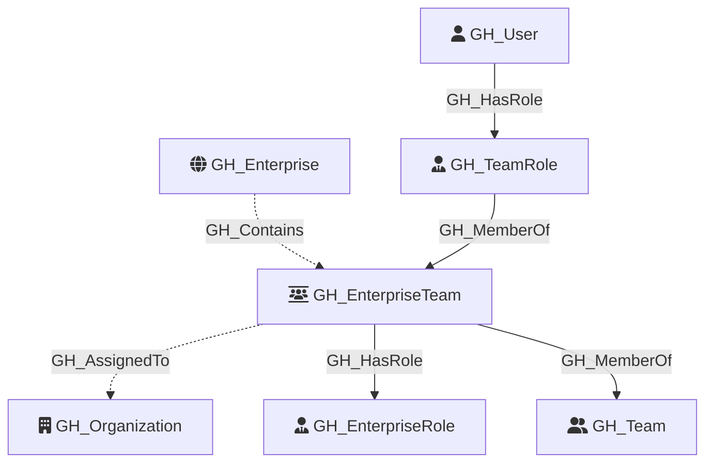

#  GH_EnterpriseTeam

Represents a GitHub enterprise-level team. Enterprise teams are assigned into organizations from the enterprise layer, can be assigned enterprise roles directly, and can map to organization-scoped `ent:` teams that then carry repository permissions.

Created by: `Git-HoundEnterpriseTeam`

## Properties

| Property Name          | Data Type | Description |
| ---------------------- | --------- | ----------- |
| objectid               | string    | A synthetic enterprise-scoped identifier for the enterprise team. |
| name                   | string    | The display name of the enterprise team. |
| node_id                | string    | The enterprise team graph identifier. Redundant with objectid. |
| github_team_id         | string    | The raw enterprise team id returned by the GitHub enterprise team API. |
| environment_name       | string    | The enterprise slug. |
| environmentid          | string    | The enterprise node id. |
| slug                   | string    | The enterprise team slug. |
| projected_slug         | string    | The projected organization team slug, typically using the `ent:` prefix. |
| group_id               | string    | When present, the SCIM group id GitHub associates with this enterprise team. |
| description            | string    | The team description. |
| created_at             | string    | When the enterprise team was created. |
| updated_at             | string    | When the enterprise team was last updated. |

Enterprise team membership is represented through a synthetic `GH_TeamRole` node (`members`) linked with `GH_MemberOf`. Organization assignment is represented with `GH_AssignedTo`, enterprise role assignment is represented with `GH_HasRole`, and the enterprise team is linked to org-visible `ent:` teams with a property-matched `GH_MemberOf` edge once those organization teams exist in the graph.

When GitHub exposes a `group_id` on the enterprise team, GitHound can also tie the GitHub enterprise team model back to the shared SCIM schema by correlating `SCIM_Group` to `GH_EnterpriseTeam` with `SCIM_Provisioned`. That gives us a native bridge from SCIM-provisioned groups into the GitHub enterprise team model without relying on provider-specific assumptions.

## Diagram

