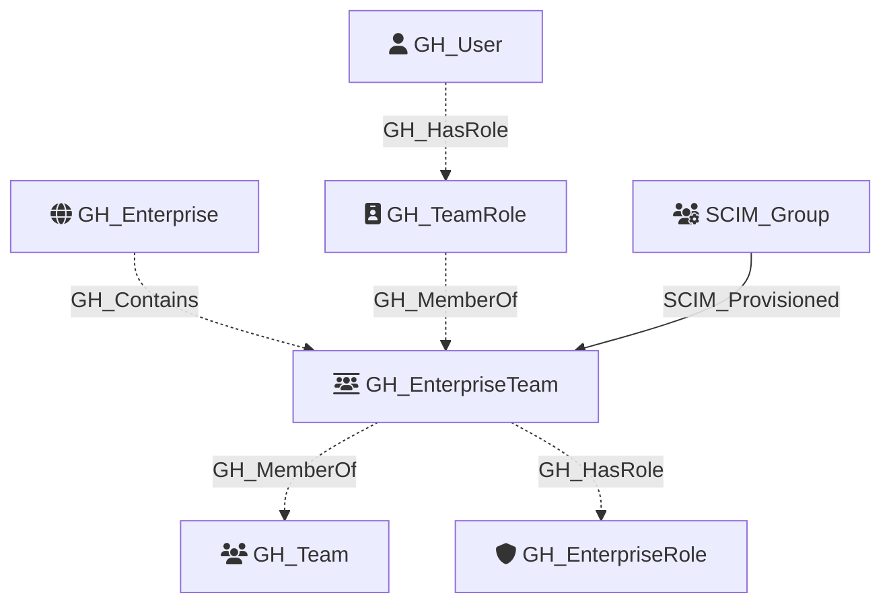

# GH_EnterpriseTeam

Represents an enterprise-level team that can span multiple organizations. Enterprise teams differ from organization teams — their membership is typically managed via IdP group provisioning (SCIM) rather than direct assignment. When linked to an IdP group, the `group_id` property contains the SCIM group GUID.

Enterprise team membership is modeled through GH_TeamRole nodes rather than direct edges. Users are connected via `GH_User -[:GH_HasRole]-> GH_TeamRole(members) -[:GH_MemberOf]-> GH_EnterpriseTeam`. Enterprise teams can also be assigned enterprise roles via `GH_EnterpriseTeam -[:GH_HasRole]-> GH_EnterpriseRole`. When an enterprise team appears at the organization level, a GH_Team node is created and linked via `GH_EnterpriseTeam -[:GH_MemberOf]-> GH_Team`.

The `organization_selection_type` indicates whether the team applies to "all" orgs or "selected" orgs, but the API does not expose which specific orgs are selected.

Created by: `Git-HoundEnterpriseTeam`

## Properties

| Property Name                | Data Type | Description                                                                |
| ---------------------------- | --------- | -------------------------------------------------------------------------- |
| objectid                     | string    | Synthetic ID in the format `GH_EntTeam_{id}`.                             |
| name                         | string    | The team's display name.                                                   |
| id                           | integer   | The numeric REST API ID of the team.                                       |
| slug                         | string    | The team's URL-safe slug (prefixed with `ent:`).                           |
| description                  | string    | The team's description.                                                    |
| group_id                     | string    | The SCIM group GUID linked to this team (null if not IdP-managed).         |
| organization_selection_type  | string    | Whether the team applies to "all" or "selected" organizations.             |
| environment_name             | string    | The enterprise slug.                                                       |
| environmentid                | string    | The enterprise's GraphQL node ID.                                          |
| created_at                   | datetime  | When the team was created.                                                 |
| updated_at                   | datetime  | When the team was last updated.                                            |

## Diagram

