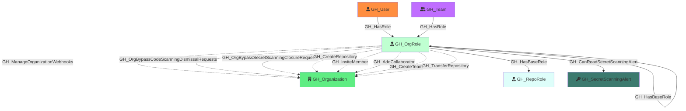

#  GH_OrgRole

Represents an organization-level role such as Owner, Member, or a custom organization role. Org roles define what permissions a user or team has at the organization level. The Owner and Member roles are default (built-in), while custom roles inherit from a base role and can have additional permissions.

Created by: `Git-HoundOrganization`

## Properties

| Property Name     | Data Type | Description                                                                              |
| ----------------- | --------- | ---------------------------------------------------------------------------------------- |
| objectid          | string    | A deterministic ID derived from the organization ID and role name.                       |
| name              | string    | The fully qualified role name (e.g., `OrgName\Owners`).                                  |
| id                | string    | Same as objectid.                                                                        |
| short_name        | string    | The short display name of the role (e.g., `Owners`, `Members`, or the custom role name). |
| type              | string    | `default` for built-in roles (Owner, Member) or `custom` for custom organization roles.  |
| environment_name  | string    | The name of the environment (GitHub organization).                                       |
| environmentid    | string    | The node_id of the environment (GitHub organization).                                    |

## Edges

### Outbound Edges

| Edge Kind                                          | Target Node            | Traversable | Description                                                                                        |
| -------------------------------------------------- | ---------------------- | ----------- | -------------------------------------------------------------------------------------------------- |
| [GH_CreateRepository](../EdgeDescriptions/GH_CreateRepository.md)                                | [GH_Organization](GH_Organization.md)        | No          | Role can create repositories in the organization.                                                  |
| [GH_InviteMember](../EdgeDescriptions/GH_InviteMember.md)                                    | [GH_Organization](GH_Organization.md)        | No          | Role can invite members (Owners only).                                                             |
| [GH_AddCollaborator](../EdgeDescriptions/GH_AddCollaborator.md)                                 | [GH_Organization](GH_Organization.md)        | No          | Role can add outside collaborators (Owners only).                                                  |
| [GH_CreateTeam](../EdgeDescriptions/GH_CreateTeam.md)                                      | [GH_Organization](GH_Organization.md)        | No          | Role can create teams.                                                                             |
| [GH_TransferRepository](../EdgeDescriptions/GH_TransferRepository.md)                              | [GH_Organization](GH_Organization.md)        | No          | Role can transfer repositories (Owners only).                                                      |
| [GH_HasBaseRole](../EdgeDescriptions/GH_HasBaseRole.md)                                     | [GH_RepoRole](GH_RepoRole.md)            | Yes         | Role inherits access to all repositories via an `all_repo_*` role (e.g., Owners → all_repo_admin). |
| [GH_HasBaseRole](../EdgeDescriptions/GH_HasBaseRole.md)                                     | [GH_OrgRole](GH_OrgRole.md)             | Yes         | Custom role inherits from a base org role.                                                         |
| [GH_ManageOrganizationWebhooks](../EdgeDescriptions/GH_ManageOrganizationWebhooks.md)                      | [GH_Organization](GH_Organization.md)        | No          | Custom role permission.                                                                            |
| [GH_WriteOrganizationActionsSecrets](../EdgeDescriptions/GH_WriteOrganizationActionsSecrets.md)                 | [GH_Organization](GH_Organization.md)        | No          | Custom role permission.                                                                            |
| [GH_WriteOrganizationActionsSettings](../EdgeDescriptions/GH_WriteOrganizationActionsSettings.md)                | [GH_Organization](GH_Organization.md)        | No          | Custom role permission.                                                                            |
| [GH_ViewSecretScanningAlerts](../EdgeDescriptions/GH_ViewSecretScanningAlerts.md)                        | [GH_Organization](GH_Organization.md)        | No          | Custom role permission.                                                                            |
| [GH_ResolveSecretScanningAlerts](../EdgeDescriptions/GH_ResolveSecretScanningAlerts.md)                     | [GH_Organization](GH_Organization.md)        | No          | Custom role permission.                                                                            |
| [GH_ReadOrganizationActionsUsageMetrics](../EdgeDescriptions/GH_ReadOrganizationActionsUsageMetrics.md)             | [GH_Organization](GH_Organization.md)        | No          | Custom role permission.                                                                            |
| [GH_ReadOrganizationCustomOrgRole](../EdgeDescriptions/GH_ReadOrganizationCustomOrgRole.md)                   | [GH_Organization](GH_Organization.md)        | No          | Custom role permission.                                                                            |
| [GH_ReadOrganizationCustomRepoRole](../EdgeDescriptions/GH_ReadOrganizationCustomRepoRole.md)                  | [GH_Organization](GH_Organization.md)        | No          | Custom role permission.                                                                            |
| [GH_WriteOrganizationCustomOrgRole](../EdgeDescriptions/GH_WriteOrganizationCustomOrgRole.md)                  | [GH_Organization](GH_Organization.md)        | No          | Custom role permission.                                                                            |
| [GH_WriteOrganizationCustomRepoRole](../EdgeDescriptions/GH_WriteOrganizationCustomRepoRole.md)                 | [GH_Organization](GH_Organization.md)        | No          | Custom role permission.                                                                            |
| [GH_WriteOrganizationNetworkConfigurations](../EdgeDescriptions/GH_WriteOrganizationNetworkConfigurations.md)          | [GH_Organization](GH_Organization.md)        | No          | Custom role permission.                                                                            |
| [GH_OrgBypassCodeScanningDismissalRequests](../EdgeDescriptions/GH_OrgBypassCodeScanningDismissalRequests.md)          | [GH_Organization](GH_Organization.md)        | No          | Custom role permission.                                                                            |
| [GH_OrgBypassSecretScanningClosureRequests](../EdgeDescriptions/GH_OrgBypassSecretScanningClosureRequests.md)          | [GH_Organization](GH_Organization.md)        | No          | Custom role permission.                                                                            |
| [GH_OrgReviewAndManageSecretScanningBypassRequests](../EdgeDescriptions/GH_OrgReviewAndManageSecretScanningBypassRequests.md)  | [GH_Organization](GH_Organization.md)        | No          | Custom role permission.                                                                            |
| [GH_OrgReviewAndManageSecretScanningClosureRequests](../EdgeDescriptions/GH_OrgReviewAndManageSecretScanningClosureRequests.md) | [GH_Organization](GH_Organization.md)        | No          | Custom role permission.                                                                            |
| [GH_CanReadSecretScanningAlert](../EdgeDescriptions/GH_CanReadSecretScanningAlert.md)                      | [GH_SecretScanningAlert](GH_SecretScanningAlert.md) | Yes         | Org role can read secret scanning alerts in the organization (computed).                           |

### Inbound Edges

| Edge Kind  | Source Node  | Traversable | Description                                          |
| ---------- | ------------ | ----------- | ---------------------------------------------------- |
| [GH_HasRole](../EdgeDescriptions/GH_HasRole.md) | [GH_User](GH_User.md)      | Yes         | A user is assigned to this organization role.        |
| [GH_HasRole](../EdgeDescriptions/GH_HasRole.md) | [GH_Team](GH_Team.md)      | Yes         | A team is assigned to this custom organization role. |

## Diagram

