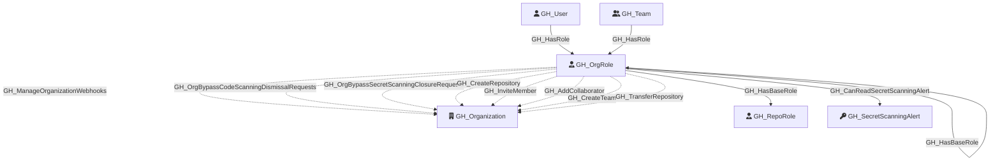

#  GH_OrgRole

Represents an organization-level role such as Owner, Member, or a custom organization role. Org roles define what permissions a user or team has at the organization level. The Owner and Member roles are default (built-in), while custom roles inherit from a base role and can have additional permissions.

Created by: `Git-HoundOrganization`

## Properties

| Property Name    | Data Type | Description                                                                              |
| ---------------- | --------- | ---------------------------------------------------------------------------------------- |
| objectid         | string    | A deterministic synthetic ID in the form `{orgNodeId}_{roleName}` for custom roles, `{orgNodeId}_owners`, `{orgNodeId}_members`, or `{orgNodeId}_all_repo_{baseRole}` for default and inherited org role nodes. |
| name             | string    | The fully qualified role name (e.g., `OrgName\Owners`).                                  |
| id               | string    | Same as objectid.                                                                        |
| short_name       | string    | The short display name of the role (e.g., `Owners`, `Members`, or the custom role name). |
| type             | string    | `default` for built-in roles (Owner, Member) or `custom` for custom organization roles.  |
| environment_name | string    | The name of the environment (GitHub organization).                                       |
| environmentid    | string    | The node_id of the environment (GitHub organization).                                    |

## Diagram

