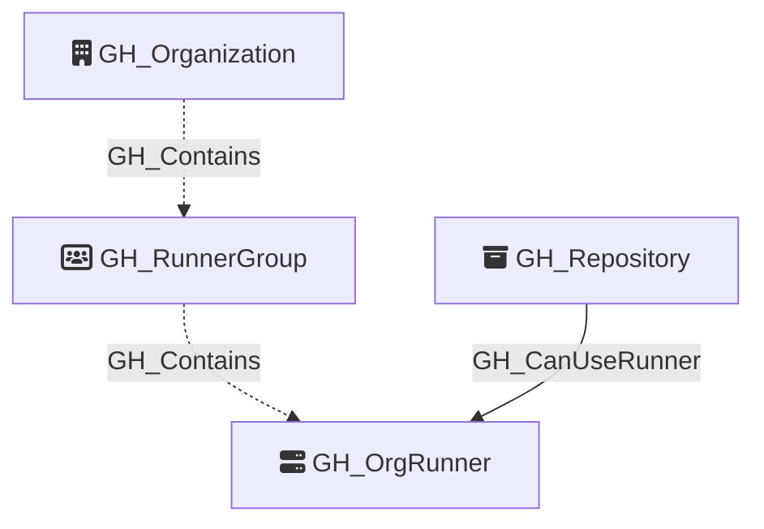

# GH_OrgRunner

Represents a GitHub Actions self-hosted runner registered at the organization scope. These runners are typically made available to repositories through runner groups.

Created by: `Git-HoundRunner`

## Properties

| Property Name         | Data Type | Description |
| --------------------- | --------- | ----------- |
| objectid              | string    | Synthetic graph identifier for the runner node in the form `{orgNodeId}_org_runner_{runnerId}`. |
| name                  | string    | The runner name shown in GitHub Actions settings. |
| node_id               | string    | Same as objectid. |
| environment_name      | string    | The organization login that owns the runner. |
| environmentid         | string    | The organization node_id. |
| runner_id             | integer   | The numeric GitHub runner ID. |
| os                    | string    | The operating system reported by the runner, such as `linux` or `macos`. |
| status                | string    | The runner status, such as `online` or `offline`. |
| busy                  | boolean   | Whether the runner is currently processing a job. |
| ephemeral             | boolean   | Whether the runner is ephemeral and intended for single-job use. |
| runner_group_id       | integer   | The numeric ID of the runner group that contains the runner. |
| runner_group_name     | string    | The name of the runner group that contains the runner. |
| labels                | string    | JSON-serialized runner labels, including default and custom labels. |

## Diagram

