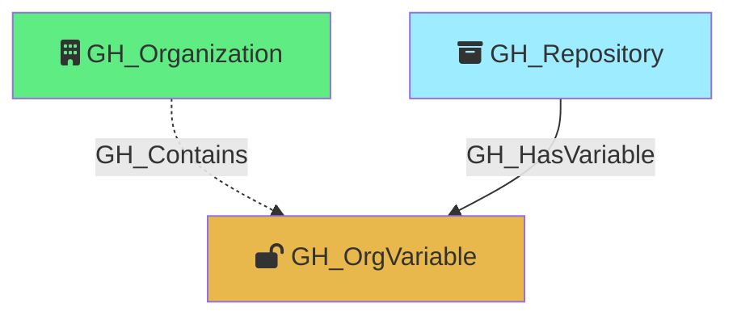

#  GH_OrgVariable

Represents an organization-level GitHub Actions variable. Organization variables can be scoped to all repositories, only private/internal repositories, or a specific set of selected repositories. The visibility property determines how GH_HasVariable edges are resolved to repository nodes. Unlike secrets, variable values are readable via the API.

Created by: `Git-HoundOrganizationSecret`

## Properties

| Property Name    | Data Type | Description                                                                                                                 |
| ---------------- | --------- | --------------------------------------------------------------------------------------------------------------------------- |
| objectid         | string    | A deterministic ID in the format `GH_OrgVariable_{orgNodeId}_{variableName}`.                                               |
| id               | string    | Same as objectid.                                                                                                           |
| name             | string    | The name of the variable.                                                                                                   |
| environment_name | string    | The name of the environment (GitHub organization).                                                                          |
| environmentid    | string    | The node_id of the environment (GitHub organization).                                                                       |
| value            | string    | The plaintext value of the variable.                                                                                        |
| created_at       | datetime  | When the variable was created.                                                                                              |
| updated_at       | datetime  | When the variable was last updated.                                                                                         |
| visibility       | string    | The variable's visibility scope: `all` (all repos), `private` (private and internal repos), or `selected` (specific repos). |

## Edges

### Outbound Edges

None

### Inbound Edges

| Edge Kind                                               | Source Node                           | Traversable | Description                                                                                                                                                               |
| ------------------------------------------------------- | ------------------------------------- | ----------- | ------------------------------------------------------------------------------------------------------------------------------------------------------------------------- |
| [GH_Contains](../EdgeDescriptions/GH_Contains.md)       | [GH_Organization](GH_Organization.md) | No          | Organization contains this variable.                                                                                                                                      |
| [GH_HasVariable](../EdgeDescriptions/GH_HasVariable.md) | [GH_Repository](GH_Repository.md)     | Yes         | Repository has access to this organization variable (resolved by visibility). Traversable because write access to the repo enables variable access via workflow creation. |

## Diagram

