#  GH_RepoRole

Represents a repository-level permission role. Each repository has five default roles (Read, Write, Admin, Triage, Maintain) plus any custom repository roles defined at the organization level. Repo roles define what actions a user or team can perform on a specific repository. Default roles form an inheritance hierarchy (Triage → Read, Maintain → Write, Admin includes all), and custom roles inherit from one of the base roles.

Created by: `Git-HoundRepository`

## Properties

| Property Name    | Data Type | Description                                                                                      |
| ---------------- | --------- | ------------------------------------------------------------------------------------------------ |
| objectid         | string    | A deterministic ID derived from the repo node_id and role name.                                  |
| name             | string    | The fully qualified role name (e.g., `repoName\read`).                                           |
| id               | string    | Same as objectid.                                                                                |
| short_name       | string    | The short role name (e.g., `read`, `write`, `admin`, `triage`, `maintain`, or custom role name). |
| type             | string    | `default` for built-in roles or `custom` for custom repository roles.                            |
| environment_name | string    | The name of the environment (GitHub organization).                                               |
| environmentid    | string    | The node_id of the environment (GitHub organization).                                            |
| repository_name  | string    | The name of the repository this role belongs to.                                                 |
| repository_id    | string    | The node_id of the repository this role belongs to.                                              |

## Edges

### Outbound Edges

| Edge Kind                                                                                       | Target Node                                         | Traversable | Description                                                                      |
| ----------------------------------------------------------------------------------------------- | --------------------------------------------------- | ----------- | -------------------------------------------------------------------------------- |
| [GH_CanEditProtection](../EdgeDescriptions/GH_CanEditProtection.md)                             | [GH_Branch](GH_Branch.md)                           | Yes         | Role can modify or remove the protection rules governing this branch (computed). |
| [GH_ReadRepoContents](../EdgeDescriptions/GH_ReadRepoContents.md)                               | [GH_Repository](GH_Repository.md)                   | No          | Read role can read repository contents.                                          |
| [GH_WriteRepoContents](../EdgeDescriptions/GH_WriteRepoContents.md)                             | [GH_Repository](GH_Repository.md)                   | No          | Write/Admin role can push to the repository.                                     |
| [GH_WriteRepoPullRequests](../EdgeDescriptions/GH_WriteRepoPullRequests.md)                     | [GH_Repository](GH_Repository.md)                   | No          | Write/Admin role can create and merge pull requests.                             |
| [GH_AdminTo](../EdgeDescriptions/GH_AdminTo.md)                                                 | [GH_Repository](GH_Repository.md)                   | No          | Admin role has full administrative access.                                       |
| [GH_ManageWebhooks](../EdgeDescriptions/GH_ManageWebhooks.md)                                   | [GH_Repository](GH_Repository.md)                   | No          | Admin role can manage webhooks.                                                  |
| [GH_ManageDeployKeys](../EdgeDescriptions/GH_ManageDeployKeys.md)                               | [GH_Repository](GH_Repository.md)                   | No          | Admin role can manage deploy keys.                                               |
| [GH_PushProtectedBranch](../EdgeDescriptions/GH_PushProtectedBranch.md)                         | [GH_Repository](GH_Repository.md)                   | No          | Admin/Maintain role can push to protected branches.                              |
| [GH_DeleteAlertsCodeScanning](../EdgeDescriptions/GH_DeleteAlertsCodeScanning.md)               | [GH_Repository](GH_Repository.md)                   | No          | Admin role can delete code scanning alerts.                                      |
| [GH_ViewSecretScanningAlerts](../EdgeDescriptions/GH_ViewSecretScanningAlerts.md)               | [GH_Repository](GH_Repository.md)                   | No          | Admin role can view secret scanning alerts.                                      |
| [GH_RunOrgMigration](../EdgeDescriptions/GH_RunOrgMigration.md)                                 | [GH_Repository](GH_Repository.md)                   | No          | Admin role can run organization migrations.                                      |
| [GH_BypassBranchProtection](../EdgeDescriptions/GH_BypassBranchProtection.md)                   | [GH_Repository](GH_Repository.md)                   | No          | Admin role can bypass branch protection rules.                                   |
| [GH_ManageSecurityProducts](../EdgeDescriptions/GH_ManageSecurityProducts.md)                   | [GH_Repository](GH_Repository.md)                   | No          | Admin role can manage security products.                                         |
| [GH_ManageRepoSecurityProducts](../EdgeDescriptions/GH_ManageRepoSecurityProducts.md)           | [GH_Repository](GH_Repository.md)                   | No          | Admin role can manage repo security products.                                    |
| [GH_EditRepoProtections](../EdgeDescriptions/GH_EditRepoProtections.md)                         | [GH_Repository](GH_Repository.md)                   | No          | Admin role can edit branch protection rules.                                     |
| [GH_JumpMergeQueue](../EdgeDescriptions/GH_JumpMergeQueue.md)                                   | [GH_Repository](GH_Repository.md)                   | No          | Admin role can jump the merge queue.                                             |
| [GH_CreateSoloMergeQueueEntry](../EdgeDescriptions/GH_CreateSoloMergeQueueEntry.md)             | [GH_Repository](GH_Repository.md)                   | No          | Admin role can create solo merge queue entries.                                  |
| [GH_EditRepoCustomPropertiesValues](../EdgeDescriptions/GH_EditRepoCustomPropertiesValues.md)   | [GH_Repository](GH_Repository.md)                   | No          | Admin role can edit custom property values.                                      |
| [GH_AddLabel](../EdgeDescriptions/GH_AddLabel.md)                                               | [GH_Repository](GH_Repository.md)                   | No          | Triage/Write/Maintain/Admin role can add labels.                                 |
| [GH_RemoveLabel](../EdgeDescriptions/GH_RemoveLabel.md)                                         | [GH_Repository](GH_Repository.md)                   | No          | Triage/Write/Maintain/Admin role can remove labels.                              |
| [GH_CloseIssue](../EdgeDescriptions/GH_CloseIssue.md)                                           | [GH_Repository](GH_Repository.md)                   | No          | Triage/Write/Maintain/Admin role can close issues.                               |
| [GH_ReopenIssue](../EdgeDescriptions/GH_ReopenIssue.md)                                         | [GH_Repository](GH_Repository.md)                   | No          | Triage/Write/Maintain/Admin role can reopen issues.                              |
| [GH_ClosePullRequest](../EdgeDescriptions/GH_ClosePullRequest.md)                               | [GH_Repository](GH_Repository.md)                   | No          | Triage/Write/Maintain/Admin role can close pull requests.                        |
| [GH_ReopenPullRequest](../EdgeDescriptions/GH_ReopenPullRequest.md)                             | [GH_Repository](GH_Repository.md)                   | No          | Triage/Write/Maintain/Admin role can reopen pull requests.                       |
| [GH_AddAssignee](../EdgeDescriptions/GH_AddAssignee.md)                                         | [GH_Repository](GH_Repository.md)                   | No          | Triage/Write/Maintain/Admin role can assign users.                               |
| [GH_DeleteIssue](../EdgeDescriptions/GH_DeleteIssue.md)                                         | [GH_Repository](GH_Repository.md)                   | No          | Admin role can delete issues.                                                    |
| [GH_RemoveAssignee](../EdgeDescriptions/GH_RemoveAssignee.md)                                   | [GH_Repository](GH_Repository.md)                   | No          | Triage/Write/Maintain/Admin role can remove assignees.                           |
| [GH_RequestPrReview](../EdgeDescriptions/GH_RequestPrReview.md)                                 | [GH_Repository](GH_Repository.md)                   | No          | Triage/Write/Maintain/Admin role can request PR reviews.                         |
| [GH_MarkAsDuplicate](../EdgeDescriptions/GH_MarkAsDuplicate.md)                                 | [GH_Repository](GH_Repository.md)                   | No          | Triage/Write/Maintain/Admin role can mark as duplicate.                          |
| [GH_SetMilestone](../EdgeDescriptions/GH_SetMilestone.md)                                       | [GH_Repository](GH_Repository.md)                   | No          | Triage/Write/Maintain/Admin role can set milestones.                             |
| [GH_SetIssueType](../EdgeDescriptions/GH_SetIssueType.md)                                       | [GH_Repository](GH_Repository.md)                   | No          | Triage/Write/Maintain/Admin role can set issue types.                            |
| [GH_ManageTopics](../EdgeDescriptions/GH_ManageTopics.md)                                       | [GH_Repository](GH_Repository.md)                   | No          | Maintain/Admin role can manage topics.                                           |
| [GH_ManageSettingsWiki](../EdgeDescriptions/GH_ManageSettingsWiki.md)                           | [GH_Repository](GH_Repository.md)                   | No          | Maintain/Admin role can manage wiki settings.                                    |
| [GH_ManageSettingsProjects](../EdgeDescriptions/GH_ManageSettingsProjects.md)                   | [GH_Repository](GH_Repository.md)                   | No          | Maintain/Admin role can manage project settings.                                 |
| [GH_ManageSettingsMergeTypes](../EdgeDescriptions/GH_ManageSettingsMergeTypes.md)               | [GH_Repository](GH_Repository.md)                   | No          | Maintain/Admin role can manage merge type settings.                              |
| [GH_ManageSettingsPages](../EdgeDescriptions/GH_ManageSettingsPages.md)                         | [GH_Repository](GH_Repository.md)                   | No          | Maintain/Admin role can manage Pages settings.                                   |
| [GH_EditRepoMetadata](../EdgeDescriptions/GH_EditRepoMetadata.md)                               | [GH_Repository](GH_Repository.md)                   | No          | Maintain/Admin role can edit repository metadata.                                |
| [GH_SetInteractionLimits](../EdgeDescriptions/GH_SetInteractionLimits.md)                       | [GH_Repository](GH_Repository.md)                   | No          | Maintain/Admin role can set interaction limits.                                  |
| [GH_SetSocialPreview](../EdgeDescriptions/GH_SetSocialPreview.md)                               | [GH_Repository](GH_Repository.md)                   | No          | Maintain/Admin role can set social preview.                                      |
| [GH_EditRepoAnnouncementBanners](../EdgeDescriptions/GH_EditRepoAnnouncementBanners.md)         | [GH_Repository](GH_Repository.md)                   | No          | Maintain/Admin role can edit announcement banners.                               |
| [GH_ReadCodeScanning](../EdgeDescriptions/GH_ReadCodeScanning.md)                               | [GH_Repository](GH_Repository.md)                   | No          | Write/Maintain/Admin role can read code scanning results.                        |
| [GH_WriteCodeScanning](../EdgeDescriptions/GH_WriteCodeScanning.md)                             | [GH_Repository](GH_Repository.md)                   | No          | Write/Maintain/Admin role can upload code scanning results.                      |
| [GH_ViewDependabotAlerts](../EdgeDescriptions/GH_ViewDependabotAlerts.md)                       | [GH_Repository](GH_Repository.md)                   | No          | Write/Maintain/Admin role can view Dependabot alerts.                            |
| [GH_ResolveDependabotAlerts](../EdgeDescriptions/GH_ResolveDependabotAlerts.md)                 | [GH_Repository](GH_Repository.md)                   | No          | Write/Maintain/Admin role can resolve Dependabot alerts.                         |
| [GH_DeleteDiscussion](../EdgeDescriptions/GH_DeleteDiscussion.md)                               | [GH_Repository](GH_Repository.md)                   | No          | Triage/Write/Maintain/Admin role can delete discussions.                         |
| [GH_ToggleDiscussionAnswer](../EdgeDescriptions/GH_ToggleDiscussionAnswer.md)                   | [GH_Repository](GH_Repository.md)                   | No          | Triage/Write/Maintain/Admin role can toggle discussion answers.                  |
| [GH_ToggleDiscussionCommentMinimize](../EdgeDescriptions/GH_ToggleDiscussionCommentMinimize.md) | [GH_Repository](GH_Repository.md)                   | No          | Triage/Write/Maintain/Admin role can minimize discussion comments.               |
| [GH_EditDiscussionCategory](../EdgeDescriptions/GH_EditDiscussionCategory.md)                   | [GH_Repository](GH_Repository.md)                   | No          | Triage/Write/Maintain/Admin role can edit discussion categories.                 |
| [GH_CreateDiscussionCategory](../EdgeDescriptions/GH_CreateDiscussionCategory.md)               | [GH_Repository](GH_Repository.md)                   | No          | Triage/Write/Maintain/Admin role can create discussion categories.               |
| [GH_ConvertIssuesToDiscussions](../EdgeDescriptions/GH_ConvertIssuesToDiscussions.md)           | [GH_Repository](GH_Repository.md)                   | No          | Triage/Write/Maintain/Admin role can convert issues to discussions.              |
| [GH_CloseDiscussion](../EdgeDescriptions/GH_CloseDiscussion.md)                                 | [GH_Repository](GH_Repository.md)                   | No          | Triage/Write/Maintain/Admin role can close discussions.                          |
| [GH_ReopenDiscussion](../EdgeDescriptions/GH_ReopenDiscussion.md)                               | [GH_Repository](GH_Repository.md)                   | No          | Triage/Write/Maintain/Admin role can reopen discussions.                         |
| [GH_EditCategoryOnDiscussion](../EdgeDescriptions/GH_EditCategoryOnDiscussion.md)               | [GH_Repository](GH_Repository.md)                   | No          | Triage/Write/Maintain/Admin role can change discussion category.                 |
| [GH_ManageDiscussionBadges](../EdgeDescriptions/GH_ManageDiscussionBadges.md)                   | [GH_Repository](GH_Repository.md)                   | No          | Write/Maintain/Admin role can manage discussion badges.                          |
| [GH_EditDiscussionComment](../EdgeDescriptions/GH_EditDiscussionComment.md)                     | [GH_Repository](GH_Repository.md)                   | No          | Triage/Write/Maintain/Admin role can edit discussion comments.                   |
| [GH_DeleteDiscussionComment](../EdgeDescriptions/GH_DeleteDiscussionComment.md)                 | [GH_Repository](GH_Repository.md)                   | No          | Triage/Write/Maintain/Admin role can delete discussion comments.                 |
| [GH_CreateTag](../EdgeDescriptions/GH_CreateTag.md)                                             | [GH_Repository](GH_Repository.md)                   | No          | Maintain/Admin role can create tags and releases.                                |
| [GH_DeleteTag](../EdgeDescriptions/GH_DeleteTag.md)                                             | [GH_Repository](GH_Repository.md)                   | No          | Admin role can delete tags and releases.                                         |
| [GH_HasBaseRole](../EdgeDescriptions/GH_HasBaseRole.md)                                         | [GH_RepoRole](GH_RepoRole.md)                       | Yes         | Role inherits from a base role (e.g., Triage → Read, Maintain → Write).          |
| [GH_CanCreateBranch](../EdgeDescriptions/GH_CanCreateBranch.md)                                 | [GH_Repository](GH_Repository.md)                   | Yes         | Role can create new branches (computed from permissions + BPR state).            |
| [GH_CanWriteBranch](../EdgeDescriptions/GH_CanWriteBranch.md)                                   | [GH_Branch](GH_Branch.md)                           | Yes         | Role can push to this branch (computed from permissions + BPR state).            |
| [GH_CanReadSecretScanningAlert](../EdgeDescriptions/GH_CanReadSecretScanningAlert.md)           | [GH_SecretScanningAlert](GH_SecretScanningAlert.md) | Yes         | Role can read secret scanning alerts in the repository (computed).               |

### Inbound Edges

| Edge Kind                                               | Source Node                   | Traversable | Description                                                                       |
| ------------------------------------------------------- | ----------------------------- | ----------- | --------------------------------------------------------------------------------- |
| [GH_HasRole](../EdgeDescriptions/GH_HasRole.md)         | [GH_User](GH_User.md)         | Yes         | A user is directly assigned to this repository role.                              |
| [GH_HasRole](../EdgeDescriptions/GH_HasRole.md)         | [GH_Team](GH_Team.md)         | Yes         | A team is assigned to this repository role.                                       |
| [GH_HasBaseRole](../EdgeDescriptions/GH_HasBaseRole.md) | [GH_OrgRole](GH_OrgRole.md)   | Yes         | An org-level `all_repo_*` role inherits to this repo role.                        |
| [GH_HasBaseRole](../EdgeDescriptions/GH_HasBaseRole.md) | [GH_RepoRole](GH_RepoRole.md) | Yes         | A higher-level repo role inherits from this role (e.g., custom role → base role). |

## Diagram

```mermaid
flowchart TD
    GH_RepoRole[fa:fa-user-tie GH_RepoRole]
    GH_Repository[fa:fa-box-archive GH_Repository]
    GH_Branch[fa:fa-code-branch GH_Branch]
    GH_BranchProtectionRule[fa:fa-shield GH_BranchProtectionRule]
    GH_User[fa:fa-user GH_User]
    GH_Team[fa:fa-user-group GH_Team]
    GH_OrgRole[fa:fa-user-tie GH_OrgRole]
    GH_SecretScanningAlert[fa:fa-key GH_SecretScanningAlert]

    style GH_RepoRole fill:#DEFEFA
    style GH_Repository fill:#9EECFF
    style GH_User fill:#FF8E40
    style GH_Team fill:#C06EFF
    style GH_OrgRole fill:#BFFFD1
    style GH_SecretScanningAlert fill:#3C7A6E

    GH_RepoRole -.->|GH_ReadRepoContents| GH_Repository
    GH_RepoRole -.->|GH_WriteRepoContents| GH_Repository
    GH_RepoRole -.->|GH_AdminTo| GH_Repository
    GH_RepoRole -.->|GH_ViewSecretScanningAlerts| GH_Repository
    GH_RepoRole -.->|GH_BypassBranchProtection| GH_Repository
    GH_RepoRole -.->|GH_EditRepoProtections| GH_Repository
    %% Note: Additional non-traversable permission edges (issue triage, discussions, settings) omitted for readability.
    GH_RepoRole -.->|GH_ReadCodeScanning| GH_Repository
    GH_RepoRole -.->|GH_WriteCodeScanning| GH_Repository
    GH_RepoRole -.->|GH_ViewDependabotAlerts| GH_Repository
    GH_RepoRole -.->|GH_ResolveDependabotAlerts| GH_Repository
    GH_RepoRole -.->|GH_DeleteIssue| GH_Repository
    GH_RepoRole -.->|GH_CreateTag| GH_Repository
    GH_RepoRole -.->|GH_DeleteTag| GH_Repository
    GH_RepoRole -->|GH_HasBaseRole| GH_RepoRole
    GH_RepoRole -->|GH_CanEditProtection| GH_Branch
    GH_RepoRole -->|GH_CanWriteBranch| GH_Branch
    GH_RepoRole -->|GH_CanCreateBranch| GH_Repository
    GH_RepoRole -->|GH_CanReadSecretScanningAlert| GH_SecretScanningAlert
    GH_User -->|GH_HasRole| GH_RepoRole
    GH_Team -->|GH_HasRole| GH_RepoRole
    GH_OrgRole -->|GH_HasBaseRole| GH_RepoRole
```

