#  GH_RepoRole

Represents a repository-level permission role. Each repository has five default roles (Read, Write, Admin, Triage, Maintain) plus any custom repository roles defined at the organization level. Repo roles define what actions a user or team can perform on a specific repository. Default roles form an inheritance hierarchy (Triage → Read, Maintain → Write, Admin includes all), and custom roles inherit from one of the base roles.

Created by: `Git-HoundRepository`

## Properties

| Property Name    | Data Type | Description                                                                                      |
| ---------------- | --------- | ------------------------------------------------------------------------------------------------ |
| objectid         | string    | A deterministic ID derived from the repo node_id and role name.                                  |
| name             | string    | The fully qualified role name (e.g., `repoName\read`).                                           |
| id               | string    | Same as objectid.                                                                                |
| short_name       | string    | The short role name (e.g., `read`, `write`, `admin`, `triage`, `maintain`, or custom role name). |
| type             | string    | `default` for built-in roles or `custom` for custom repository roles.                            |
| environment_name | string    | The name of the environment (GitHub organization).                                               |
| environmentid    | string    | The node_id of the environment (GitHub organization).                                            |
| repository_name  | string    | The name of the repository this role belongs to.                                                 |
| repository_id    | string    | The node_id of the repository this role belongs to.                                              |

## Diagram

```mermaid
flowchart TD
    GH_RepoRole[fa:fa-user-tie GH_RepoRole]
    GH_Repository[fa:fa-box-archive GH_Repository]
    GH_Branch[fa:fa-code-branch GH_Branch]
    GH_BranchProtectionRule[fa:fa-shield GH_BranchProtectionRule]
    GH_User[fa:fa-user GH_User]
    GH_Team[fa:fa-user-group GH_Team]
    GH_OrgRole[fa:fa-user-tie GH_OrgRole]
    GH_SecretScanningAlert[fa:fa-key GH_SecretScanningAlert]


    GH_RepoRole -.->|GH_ReadRepoContents| GH_Repository
    GH_RepoRole -.->|GH_WriteRepoContents| GH_Repository
    GH_RepoRole -.->|GH_AdminTo| GH_Repository
    GH_RepoRole -.->|GH_ViewSecretScanningAlerts| GH_Repository
    GH_RepoRole -.->|GH_BypassBranchProtection| GH_Repository
    GH_RepoRole -.->|GH_EditRepoProtections| GH_Repository
    %% Note: Additional non-traversable permission edges (issue triage, discussions, settings) omitted for readability.
    GH_RepoRole -.->|GH_ReadCodeScanning| GH_Repository
    GH_RepoRole -.->|GH_WriteCodeScanning| GH_Repository
    GH_RepoRole -.->|GH_ViewDependabotAlerts| GH_Repository
    GH_RepoRole -.->|GH_ResolveDependabotAlerts| GH_Repository
    GH_RepoRole -.->|GH_DeleteIssue| GH_Repository
    GH_RepoRole -.->|GH_CreateTag| GH_Repository
    GH_RepoRole -.->|GH_DeleteTag| GH_Repository
    GH_RepoRole -->|GH_HasBaseRole| GH_RepoRole
    GH_RepoRole -->|GH_CanEditProtection| GH_Branch
    GH_RepoRole -->|GH_CanWriteBranch| GH_Branch
    GH_RepoRole -->|GH_CanCreateBranch| GH_Repository
    GH_RepoRole -->|GH_CanReadSecretScanningAlert| GH_SecretScanningAlert
    GH_User -->|GH_HasRole| GH_RepoRole
    GH_Team -->|GH_HasRole| GH_RepoRole
    GH_OrgRole -->|GH_HasBaseRole| GH_RepoRole
```

