#  GH_Repository

Represents a GitHub repository within the organization. Repository nodes capture metadata about the repo including visibility, Actions enablement status, self-hosted runner eligibility, and security configuration. Repository role nodes (GH_RepoRole) are created alongside each repository to represent the permission levels available.

Created by: `Git-HoundRepository`

## Properties

| Property Name               | Data Type | Description                                                                  |
| --------------------------- | --------- | ---------------------------------------------------------------------------- |
| objectid                    | string    | The GitHub `node_id` of the repository, used as the unique graph identifier. |
| id                          | integer   | The numeric GitHub ID of the repository.                                     |
| node_id                     | string    | The GitHub GraphQL node ID. Redundant with objectid.                         |
| name                        | string    | The repository name.                                                         |
| full_name                   | string    | The fully qualified name (e.g., `org/repo`).                                 |
| environment_name            | string    | The name of the environment (GitHub organization).                           |
| environmentid               | string    | The node_id of the environment (GitHub organization).                        |
| owner_id                    | integer   | The numeric ID of the repository owner.                                      |
| owner_node_id               | string    | The node_id of the repository owner.                                         |
| owner_name                  | string    | The login of the repository owner.                                           |
| private                     | boolean   | Whether the repository is private.                                           |
| visibility                  | string    | The visibility level: `public`, `private`, or `internal`.                    |
| html_url                    | string    | URL to the repository on GitHub.                                             |
| description                 | string    | The repository description.                                                  |
| created_at                  | datetime  | When the repository was created.                                             |
| updated_at                  | datetime  | When the repository was last updated.                                        |
| pushed_at                   | datetime  | When the repository last had a push.                                         |
| archived                    | boolean   | Whether the repository is archived.                                          |
| disabled                    | boolean   | Whether the repository is disabled.                                          |
| open_issues_count           | integer   | Number of open issues.                                                       |
| allow_forking               | boolean   | Whether forking is allowed.                                                  |
| web_commit_signoff_required | boolean   | Whether web-based commits require sign-off.                                  |
| forks                       | integer   | Number of forks.                                                             |
| open_issues                 | integer   | Number of open issues (includes pull requests).                              |
| watchers                    | integer   | Number of watchers.                                                          |
| default_branch              | string    | The name of the default branch (e.g., `main`).                               |
| actions_enabled             | boolean   | Whether GitHub Actions is enabled for this repository.                       |
| self_hosted_runners_enabled | boolean   | Whether this repository is currently allowed to use self-hosted runners under the organization's runner policy. |
| secret_scanning             | string    | Status of secret scanning (e.g., `enabled`, `disabled`).                     |

## Diagram

```mermaid
flowchart TD
    GH_Repository[fa:fa-box-archive GH_Repository]
    GH_Organization[fa:fa-building GH_Organization]
    GH_Branch[fa:fa-code-branch GH_Branch]
    GH_Workflow[fa:fa-cogs GH_Workflow]
    GH_Environment[fa:fa-leaf GH_Environment]
    GH_OrgRunner[fa:fa-server GH_OrgRunner]
    GH_RepoRunner[fa:fa-server GH_RepoRunner]
    GH_OrgSecret[fa:fa-lock GH_OrgSecret]
    GH_RepoSecret[fa:fa-lock GH_RepoSecret]
    GH_OrgVariable[fa:fa-lock-open GH_OrgVariable]
    GH_RepoVariable[fa:fa-lock-open GH_RepoVariable]
    GH_SecretScanningAlert[fa:fa-key GH_SecretScanningAlert]
    GH_RepoRole[fa:fa-user-tie GH_RepoRole]
    AZFederatedIdentityCredential[fa:fa-id-card AZFederatedIdentityCredential]


    GH_PersonalAccessToken[fa:fa-key GH_PersonalAccessToken]


    GH_Organization -->|GH_Owns| GH_Repository
    GH_Repository -.->|GH_HasBranch| GH_Branch
    GH_Repository -.->|GH_HasWorkflow| GH_Workflow
    GH_Repository -.->|GH_HasEnvironment| GH_Environment
    GH_Repository -.->|GH_Contains| GH_RepoRunner
    GH_Repository -->|GH_HasSecret| GH_OrgSecret
    GH_Repository -->|GH_HasSecret| GH_RepoSecret
    GH_Repository -->|GH_HasVariable| GH_OrgVariable
    GH_Repository -->|GH_HasVariable| GH_RepoVariable
    GH_Repository -.->|GH_CanUseRunner| GH_OrgRunner
    GH_Repository -.->|GH_CanUseRunner| GH_RepoRunner
    GH_Repository -.->|GH_Contains| GH_RepoSecret
    GH_Repository -.->|GH_Contains| GH_RepoVariable
    GH_Repository -.->|GH_Contains| GH_SecretScanningAlert
    GH_RepoRole -.->|GH_ReadRepoContents| GH_Repository
    GH_RepoRole -.->|GH_WriteRepoContents| GH_Repository
    GH_RepoRole -.->|GH_AdminTo| GH_Repository
    GH_RepoRole -.->|GH_BypassBranchProtection| GH_Repository
    GH_RepoRole -.->|GH_EditRepoProtections| GH_Repository
    GH_RepoRole -.->|GH_ViewSecretScanningAlerts| GH_Repository
    %% Note: Additional non-traversable permission edges (issue triage, discussions, settings) omitted for readability.
    GH_RepoRole -.->|GH_ReadCodeScanning| GH_Repository
    GH_RepoRole -.->|GH_WriteCodeScanning| GH_Repository
    GH_RepoRole -.->|GH_ViewDependabotAlerts| GH_Repository
    GH_RepoRole -.->|GH_ResolveDependabotAlerts| GH_Repository
    GH_RepoRole -.->|GH_DeleteIssue| GH_Repository
    GH_RepoRole -.->|GH_CreateTag| GH_Repository
    GH_RepoRole -.->|GH_DeleteTag| GH_Repository
    GH_RepoRole -->|GH_CanCreateBranch| GH_Repository
    GH_Repository -->|GH_CanAssumeIdentity| AZFederatedIdentityCredential
```

