#  GH_Repository

Represents a GitHub repository within the organization. Repository nodes capture metadata about the repo including visibility, Actions enablement status, and security configuration. Repository role nodes (GH_RepoRole) are created alongside each repository to represent the permission levels available.

Created by: `Git-HoundRepository`

## Properties

| Property Name               | Data Type | Description                                                                  |
| --------------------------- | --------- | ---------------------------------------------------------------------------- |
| objectid                    | string    | The GitHub `node_id` of the repository, used as the unique graph identifier. |
| id                          | integer   | The numeric GitHub ID of the repository.                                     |
| node_id                     | string    | The GitHub GraphQL node ID. Redundant with objectid.                         |
| name                        | string    | The repository name.                                                         |
| full_name                   | string    | The fully qualified name (e.g., `org/repo`).                                 |
| environment_name            | string    | The name of the environment (GitHub organization).                           |
| environmentid               | string    | The node_id of the environment (GitHub organization).                        |
| owner_id                    | integer   | The numeric ID of the repository owner.                                      |
| owner_node_id               | string    | The node_id of the repository owner.                                         |
| owner_name                  | string    | The login of the repository owner.                                           |
| private                     | boolean   | Whether the repository is private.                                           |
| visibility                  | string    | The visibility level: `public`, `private`, or `internal`.                    |
| html_url                    | string    | URL to the repository on GitHub.                                             |
| description                 | string    | The repository description.                                                  |
| created_at                  | datetime  | When the repository was created.                                             |
| updated_at                  | datetime  | When the repository was last updated.                                        |
| pushed_at                   | datetime  | When the repository last had a push.                                         |
| archived                    | boolean   | Whether the repository is archived.                                          |
| disabled                    | boolean   | Whether the repository is disabled.                                          |
| open_issues_count           | integer   | Number of open issues.                                                       |
| allow_forking               | boolean   | Whether forking is allowed.                                                  |
| web_commit_signoff_required | boolean   | Whether web-based commits require sign-off.                                  |
| forks                       | integer   | Number of forks.                                                             |
| open_issues                 | integer   | Number of open issues (includes pull requests).                              |
| watchers                    | integer   | Number of watchers.                                                          |
| default_branch              | string    | The name of the default branch (e.g., `main`).                               |
| actions_enabled             | boolean   | Whether GitHub Actions is enabled for this repository.                       |
| secret_scanning             | string    | Status of secret scanning (e.g., `enabled`, `disabled`).                     |

## Edges

### Outbound Edges

| Edge Kind                                                           | Target Node                                                                                                        | Traversable | Description                                                                                                                                          |
| ------------------------------------------------------------------- | ------------------------------------------------------------------------------------------------------------------ | ----------- | ---------------------------------------------------------------------------------------------------------------------------------------------------- |
| [GH_HasBranch](../EdgeDescriptions/GH_HasBranch.md)                 | [GH_Branch](GH_Branch.md)                                                                                          | No          | Repository has a branch.                                                                                                                             |
| [GH_HasWorkflow](../EdgeDescriptions/GH_HasWorkflow.md)             | [GH_Workflow](GH_Workflow.md)                                                                                      | No          | Repository has a workflow.                                                                                                                           |
| [GH_HasEnvironment](../EdgeDescriptions/GH_HasEnvironment.md)       | [GH_Environment](GH_Environment.md)                                                                                | No          | Repository has a deployment environment (when no custom branch policies).                                                                            |
| [GH_HasSecret](../EdgeDescriptions/GH_HasSecret.md)                 | [GH_OrgSecret](GH_OrgSecret.md)                                                                                    | Yes         | Repository has access to an organization-level secret. Traversable because write access to the repo enables secret access via workflow creation.     |
| [GH_HasSecret](../EdgeDescriptions/GH_HasSecret.md)                 | [GH_RepoSecret](GH_RepoSecret.md)                                                                                  | Yes         | Repository has a repository-level secret. Traversable because write access to the repo enables secret access via workflow creation.                  |
| [GH_HasVariable](../EdgeDescriptions/GH_HasVariable.md)             | [GH_OrgVariable](GH_OrgVariable.md)                                                                                | Yes         | Repository has access to an organization-level variable. Traversable because write access to the repo enables variable access via workflow creation. |
| [GH_HasVariable](../EdgeDescriptions/GH_HasVariable.md)             | [GH_RepoVariable](GH_RepoVariable.md)                                                                              | Yes         | Repository has a repository-level variable. Traversable because write access to the repo enables variable access via workflow creation.              |
| [GH_Contains](../EdgeDescriptions/GH_Contains.md)                   | [GH_RepoSecret](GH_RepoSecret.md)                                                                                  | No          | Repository contains a repository-level secret.                                                                                                       |
| [GH_Contains](../EdgeDescriptions/GH_Contains.md)                   | [GH_RepoVariable](GH_RepoVariable.md)                                                                              | No          | Repository contains a repository-level variable.                                                                                                     |
| [GH_Contains](../EdgeDescriptions/GH_Contains.md)                   | [GH_SecretScanningAlert](GH_SecretScanningAlert.md)                                                                | No          | Repository contains a secret scanning alert.                                                                                                         |
| [GH_CanAssumeIdentity](../EdgeDescriptions/GH_CanAssumeIdentity.md) | [AZFederatedIdentityCredential](https://bloodhound.specterops.io/resources/nodes/az-federated-identity-credential) | Yes         | Repository can assume an Azure federated identity via OIDC (subject: *).                                                                             |

### Inbound Edges

| Edge Kind                                                                                       | Source Node                                    | Traversable | Description                                                                                                                                                                 |
| ----------------------------------------------------------------------------------------------- | ---------------------------------------------- | ----------- | --------------------------------------------------------------------------------------------------------------------------------------------------------------------------- |
| [GH_Owns](../EdgeDescriptions/GH_Owns.md)                                                       | [GH_Organization](GH_Organization.md)          | Yes         | Organization owns this repository.                                                                                                                                          |
| [GH_WriteRepoContents](../EdgeDescriptions/GH_WriteRepoContents.md)                             | [GH_RepoRole](GH_RepoRole.md)                  | No          | Repo role can write repository contents. Non-traversable because write access alone is necessary but not sufficient for push access — branch protection rules may block it. |
| [GH_AdminTo](../EdgeDescriptions/GH_AdminTo.md)                                                 | [GH_RepoRole](GH_RepoRole.md)                  | No          | Repo role has admin access. Traversable because admin confers full control of the repository.                                                                               |
| [GH_CanCreateBranch](../EdgeDescriptions/GH_CanCreateBranch.md)                                 | [GH_RepoRole](GH_RepoRole.md)                  | Yes         | Repo role can create new branches (computed from permissions + branch protection rules).                                                                                    |
| [GH_CanCreateBranch](../EdgeDescriptions/GH_CanCreateBranch.md)                                 | [GH_User](GH_User.md) or [GH_Team](GH_Team.md) | Yes         | User or team can create new branches via per-rule allowance (computed — delta only).                                                                                        |
| [GH_ReadRepoContents](../EdgeDescriptions/GH_ReadRepoContents.md)                               | [GH_RepoRole](GH_RepoRole.md)                  | No          | Repo role can read repository contents.                                                                                                                                     |
| [GH_WriteRepoPullRequests](../EdgeDescriptions/GH_WriteRepoPullRequests.md)                     | [GH_RepoRole](GH_RepoRole.md)                  | No          | Repo role can create and merge pull requests.                                                                                                                               |
| [GH_ManageWebhooks](../EdgeDescriptions/GH_ManageWebhooks.md)                                   | [GH_RepoRole](GH_RepoRole.md)                  | No          | Repo role can manage webhooks.                                                                                                                                              |
| [GH_ManageDeployKeys](../EdgeDescriptions/GH_ManageDeployKeys.md)                               | [GH_RepoRole](GH_RepoRole.md)                  | No          | Repo role can manage deploy keys.                                                                                                                                           |
| [GH_PushProtectedBranch](../EdgeDescriptions/GH_PushProtectedBranch.md)                         | [GH_RepoRole](GH_RepoRole.md)                  | No          | Repo role can push to protected branches.                                                                                                                                   |
| [GH_DeleteAlertsCodeScanning](../EdgeDescriptions/GH_DeleteAlertsCodeScanning.md)               | [GH_RepoRole](GH_RepoRole.md)                  | No          | Repo role can delete code scanning alerts.                                                                                                                                  |
| [GH_ViewSecretScanningAlerts](../EdgeDescriptions/GH_ViewSecretScanningAlerts.md)               | [GH_RepoRole](GH_RepoRole.md)                  | No          | Repo role can view secret scanning alerts.                                                                                                                                  |
| [GH_ResolveSecretScanningAlerts](../EdgeDescriptions/GH_ResolveSecretScanningAlerts.md)         | [GH_RepoRole](GH_RepoRole.md)                  | No          | Repo role can resolve secret scanning alerts.                                                                                                                               |
| [GH_RunOrgMigration](../EdgeDescriptions/GH_RunOrgMigration.md)                                 | [GH_RepoRole](GH_RepoRole.md)                  | No          | Repo role can run organization migrations.                                                                                                                                  |
| [GH_BypassBranchProtection](../EdgeDescriptions/GH_BypassBranchProtection.md)                   | [GH_RepoRole](GH_RepoRole.md)                  | No          | Repo role can bypass branch protection rules.                                                                                                                               |
| [GH_ManageSecurityProducts](../EdgeDescriptions/GH_ManageSecurityProducts.md)                   | [GH_RepoRole](GH_RepoRole.md)                  | No          | Repo role can manage security products.                                                                                                                                     |
| [GH_ManageRepoSecurityProducts](../EdgeDescriptions/GH_ManageRepoSecurityProducts.md)           | [GH_RepoRole](GH_RepoRole.md)                  | No          | Repo role can manage repo security products.                                                                                                                                |
| [GH_EditRepoProtections](../EdgeDescriptions/GH_EditRepoProtections.md)                         | [GH_RepoRole](GH_RepoRole.md)                  | No          | Repo role can edit branch protection rules.                                                                                                                                 |
| [GH_JumpMergeQueue](../EdgeDescriptions/GH_JumpMergeQueue.md)                                   | [GH_RepoRole](GH_RepoRole.md)                  | No          | Repo role can jump the merge queue.                                                                                                                                         |
| [GH_CreateSoloMergeQueueEntry](../EdgeDescriptions/GH_CreateSoloMergeQueueEntry.md)             | [GH_RepoRole](GH_RepoRole.md)                  | No          | Repo role can create solo merge queue entries.                                                                                                                              |
| [GH_EditRepoCustomPropertiesValues](../EdgeDescriptions/GH_EditRepoCustomPropertiesValues.md)   | [GH_RepoRole](GH_RepoRole.md)                  | No          | Repo role can edit custom property values.                                                                                                                                  |
| [GH_AddLabel](../EdgeDescriptions/GH_AddLabel.md)                                               | [GH_RepoRole](GH_RepoRole.md)                  | No          | Repo role can add labels.                                                                                                                                                   |
| [GH_RemoveLabel](../EdgeDescriptions/GH_RemoveLabel.md)                                         | [GH_RepoRole](GH_RepoRole.md)                  | No          | Repo role can remove labels.                                                                                                                                                |
| [GH_CloseIssue](../EdgeDescriptions/GH_CloseIssue.md)                                           | [GH_RepoRole](GH_RepoRole.md)                  | No          | Repo role can close issues.                                                                                                                                                 |
| [GH_ReopenIssue](../EdgeDescriptions/GH_ReopenIssue.md)                                         | [GH_RepoRole](GH_RepoRole.md)                  | No          | Repo role can reopen issues.                                                                                                                                                |
| [GH_ClosePullRequest](../EdgeDescriptions/GH_ClosePullRequest.md)                               | [GH_RepoRole](GH_RepoRole.md)                  | No          | Repo role can close pull requests.                                                                                                                                          |
| [GH_ReopenPullRequest](../EdgeDescriptions/GH_ReopenPullRequest.md)                             | [GH_RepoRole](GH_RepoRole.md)                  | No          | Repo role can reopen pull requests.                                                                                                                                         |
| [GH_AddAssignee](../EdgeDescriptions/GH_AddAssignee.md)                                         | [GH_RepoRole](GH_RepoRole.md)                  | No          | Repo role can assign users.                                                                                                                                                 |
| [GH_DeleteIssue](../EdgeDescriptions/GH_DeleteIssue.md)                                         | [GH_RepoRole](GH_RepoRole.md)                  | No          | Repo role can delete issues.                                                                                                                                                |
| [GH_RemoveAssignee](../EdgeDescriptions/GH_RemoveAssignee.md)                                   | [GH_RepoRole](GH_RepoRole.md)                  | No          | Repo role can remove assignees.                                                                                                                                             |
| [GH_RequestPrReview](../EdgeDescriptions/GH_RequestPrReview.md)                                 | [GH_RepoRole](GH_RepoRole.md)                  | No          | Repo role can request PR reviews.                                                                                                                                           |
| [GH_MarkAsDuplicate](../EdgeDescriptions/GH_MarkAsDuplicate.md)                                 | [GH_RepoRole](GH_RepoRole.md)                  | No          | Repo role can mark as duplicate.                                                                                                                                            |
| [GH_SetMilestone](../EdgeDescriptions/GH_SetMilestone.md)                                       | [GH_RepoRole](GH_RepoRole.md)                  | No          | Repo role can set milestones.                                                                                                                                               |
| [GH_SetIssueType](../EdgeDescriptions/GH_SetIssueType.md)                                       | [GH_RepoRole](GH_RepoRole.md)                  | No          | Repo role can set issue types.                                                                                                                                              |
| [GH_ManageTopics](../EdgeDescriptions/GH_ManageTopics.md)                                       | [GH_RepoRole](GH_RepoRole.md)                  | No          | Repo role can manage topics.                                                                                                                                                |
| [GH_ManageSettingsWiki](../EdgeDescriptions/GH_ManageSettingsWiki.md)                           | [GH_RepoRole](GH_RepoRole.md)                  | No          | Repo role can manage wiki settings.                                                                                                                                         |
| [GH_ManageSettingsProjects](../EdgeDescriptions/GH_ManageSettingsProjects.md)                   | [GH_RepoRole](GH_RepoRole.md)                  | No          | Repo role can manage project settings.                                                                                                                                      |
| [GH_ManageSettingsMergeTypes](../EdgeDescriptions/GH_ManageSettingsMergeTypes.md)               | [GH_RepoRole](GH_RepoRole.md)                  | No          | Repo role can manage merge type settings.                                                                                                                                   |
| [GH_ManageSettingsPages](../EdgeDescriptions/GH_ManageSettingsPages.md)                         | [GH_RepoRole](GH_RepoRole.md)                  | No          | Repo role can manage Pages settings.                                                                                                                                        |
| [GH_EditRepoMetadata](../EdgeDescriptions/GH_EditRepoMetadata.md)                               | [GH_RepoRole](GH_RepoRole.md)                  | No          | Repo role can edit repository metadata.                                                                                                                                     |
| [GH_SetInteractionLimits](../EdgeDescriptions/GH_SetInteractionLimits.md)                       | [GH_RepoRole](GH_RepoRole.md)                  | No          | Repo role can set interaction limits.                                                                                                                                       |
| [GH_SetSocialPreview](../EdgeDescriptions/GH_SetSocialPreview.md)                               | [GH_RepoRole](GH_RepoRole.md)                  | No          | Repo role can set social preview.                                                                                                                                           |
| [GH_EditRepoAnnouncementBanners](../EdgeDescriptions/GH_EditRepoAnnouncementBanners.md)         | [GH_RepoRole](GH_RepoRole.md)                  | No          | Repo role can edit announcement banners.                                                                                                                                    |
| [GH_ReadCodeScanning](../EdgeDescriptions/GH_ReadCodeScanning.md)                               | [GH_RepoRole](GH_RepoRole.md)                  | No          | Repo role can read code scanning results.                                                                                                                                   |
| [GH_WriteCodeScanning](../EdgeDescriptions/GH_WriteCodeScanning.md)                             | [GH_RepoRole](GH_RepoRole.md)                  | No          | Repo role can upload code scanning results.                                                                                                                                 |
| [GH_ViewDependabotAlerts](../EdgeDescriptions/GH_ViewDependabotAlerts.md)                       | [GH_RepoRole](GH_RepoRole.md)                  | No          | Repo role can view Dependabot alerts.                                                                                                                                       |
| [GH_ResolveDependabotAlerts](../EdgeDescriptions/GH_ResolveDependabotAlerts.md)                 | [GH_RepoRole](GH_RepoRole.md)                  | No          | Repo role can resolve Dependabot alerts.                                                                                                                                    |
| [GH_DeleteDiscussion](../EdgeDescriptions/GH_DeleteDiscussion.md)                               | [GH_RepoRole](GH_RepoRole.md)                  | No          | Repo role can delete discussions.                                                                                                                                           |
| [GH_ToggleDiscussionAnswer](../EdgeDescriptions/GH_ToggleDiscussionAnswer.md)                   | [GH_RepoRole](GH_RepoRole.md)                  | No          | Repo role can toggle discussion answers.                                                                                                                                    |
| [GH_ToggleDiscussionCommentMinimize](../EdgeDescriptions/GH_ToggleDiscussionCommentMinimize.md) | [GH_RepoRole](GH_RepoRole.md)                  | No          | Repo role can minimize discussion comments.                                                                                                                                 |
| [GH_EditDiscussionCategory](../EdgeDescriptions/GH_EditDiscussionCategory.md)                   | [GH_RepoRole](GH_RepoRole.md)                  | No          | Repo role can edit discussion categories.                                                                                                                                   |
| [GH_CreateDiscussionCategory](../EdgeDescriptions/GH_CreateDiscussionCategory.md)               | [GH_RepoRole](GH_RepoRole.md)                  | No          | Repo role can create discussion categories.                                                                                                                                 |
| [GH_ConvertIssuesToDiscussions](../EdgeDescriptions/GH_ConvertIssuesToDiscussions.md)           | [GH_RepoRole](GH_RepoRole.md)                  | No          | Repo role can convert issues to discussions.                                                                                                                                |
| [GH_CloseDiscussion](../EdgeDescriptions/GH_CloseDiscussion.md)                                 | [GH_RepoRole](GH_RepoRole.md)                  | No          | Repo role can close discussions.                                                                                                                                            |
| [GH_ReopenDiscussion](../EdgeDescriptions/GH_ReopenDiscussion.md)                               | [GH_RepoRole](GH_RepoRole.md)                  | No          | Repo role can reopen discussions.                                                                                                                                           |
| [GH_EditCategoryOnDiscussion](../EdgeDescriptions/GH_EditCategoryOnDiscussion.md)               | [GH_RepoRole](GH_RepoRole.md)                  | No          | Repo role can change discussion category.                                                                                                                                   |
| [GH_ManageDiscussionBadges](../EdgeDescriptions/GH_ManageDiscussionBadges.md)                   | [GH_RepoRole](GH_RepoRole.md)                  | No          | Repo role can manage discussion badges.                                                                                                                                     |
| [GH_EditDiscussionComment](../EdgeDescriptions/GH_EditDiscussionComment.md)                     | [GH_RepoRole](GH_RepoRole.md)                  | No          | Repo role can edit discussion comments.                                                                                                                                     |
| [GH_DeleteDiscussionComment](../EdgeDescriptions/GH_DeleteDiscussionComment.md)                 | [GH_RepoRole](GH_RepoRole.md)                  | No          | Repo role can delete discussion comments.                                                                                                                                   |
| [GH_CreateTag](../EdgeDescriptions/GH_CreateTag.md)                                             | [GH_RepoRole](GH_RepoRole.md)                  | No          | Repo role can create tags and releases.                                                                                                                                     |
| [GH_DeleteTag](../EdgeDescriptions/GH_DeleteTag.md)                                             | [GH_RepoRole](GH_RepoRole.md)                  | No          | Repo role can delete tags and releases.                                                                                                                                     |

## Diagram

```mermaid
flowchart TD
    GH_Repository[fa:fa-box-archive GH_Repository]
    GH_Organization[fa:fa-building GH_Organization]
    GH_Branch[fa:fa-code-branch GH_Branch]
    GH_Workflow[fa:fa-cogs GH_Workflow]
    GH_Environment[fa:fa-leaf GH_Environment]
    GH_OrgSecret[fa:fa-lock GH_OrgSecret]
    GH_RepoSecret[fa:fa-lock GH_RepoSecret]
    GH_OrgVariable[fa:fa-lock-open GH_OrgVariable]
    GH_RepoVariable[fa:fa-lock-open GH_RepoVariable]
    GH_SecretScanningAlert[fa:fa-key GH_SecretScanningAlert]
    GH_RepoRole[fa:fa-user-tie GH_RepoRole]
    AZFederatedIdentityCredential[fa:fa-id-card AZFederatedIdentityCredential]

    style GH_Repository fill:#9EECFF
    style GH_Organization fill:#5FED83
    style GH_Branch fill:#FF80D2
    style GH_Workflow fill:#FFE4A1
    style GH_Environment fill:#D5F2C2
    style GH_OrgSecret fill:#1FB65A
    style GH_RepoSecret fill:#32BEE6
    style GH_OrgVariable fill:#E8B84D
    style GH_RepoVariable fill:#E89B5C
    style GH_SecretScanningAlert fill:#3C7A6E
    style GH_RepoRole fill:#DEFEFA
    style AZFederatedIdentityCredential fill:#FF80D2

    GH_PersonalAccessToken[fa:fa-key GH_PersonalAccessToken]

    style GH_PersonalAccessToken fill:#F5A623

    GH_Organization -->|GH_Owns| GH_Repository
    GH_Repository -.->|GH_HasBranch| GH_Branch
    GH_Repository -.->|GH_HasWorkflow| GH_Workflow
    GH_Repository -.->|GH_HasEnvironment| GH_Environment
    GH_Repository -->|GH_HasSecret| GH_OrgSecret
    GH_Repository -->|GH_HasSecret| GH_RepoSecret
    GH_Repository -->|GH_HasVariable| GH_OrgVariable
    GH_Repository -->|GH_HasVariable| GH_RepoVariable
    GH_Repository -.->|GH_Contains| GH_RepoSecret
    GH_Repository -.->|GH_Contains| GH_RepoVariable
    GH_Repository -.->|GH_Contains| GH_SecretScanningAlert
    GH_RepoRole -.->|GH_ReadRepoContents| GH_Repository
    GH_RepoRole -.->|GH_WriteRepoContents| GH_Repository
    GH_RepoRole -.->|GH_AdminTo| GH_Repository
    GH_RepoRole -.->|GH_BypassBranchProtection| GH_Repository
    GH_RepoRole -.->|GH_EditRepoProtections| GH_Repository
    GH_RepoRole -.->|GH_ViewSecretScanningAlerts| GH_Repository
    %% Note: Additional non-traversable permission edges (issue triage, discussions, settings) omitted for readability.
    GH_RepoRole -.->|GH_ReadCodeScanning| GH_Repository
    GH_RepoRole -.->|GH_WriteCodeScanning| GH_Repository
    GH_RepoRole -.->|GH_ViewDependabotAlerts| GH_Repository
    GH_RepoRole -.->|GH_ResolveDependabotAlerts| GH_Repository
    GH_RepoRole -.->|GH_DeleteIssue| GH_Repository
    GH_RepoRole -.->|GH_CreateTag| GH_Repository
    GH_RepoRole -.->|GH_DeleteTag| GH_Repository
    GH_RepoRole -->|GH_CanCreateBranch| GH_Repository
    GH_Repository -->|GH_CanAssumeIdentity| AZFederatedIdentityCredential
```

