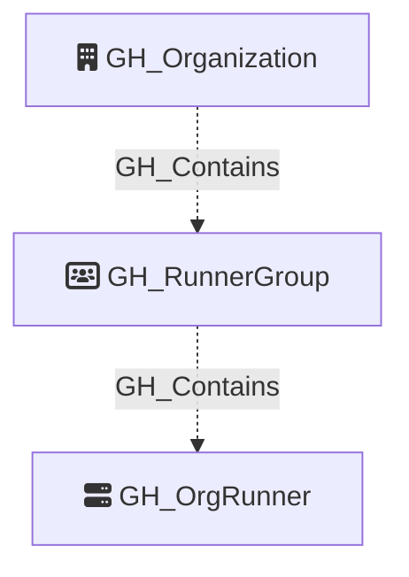

# GH_RunnerGroup

Represents an organization-level self-hosted runner group. Runner groups are the policy boundary that determines which repositories may use organization-scoped runners.

Created by: `Git-HoundRunner`

## Properties

| Property Name               | Data Type | Description |
| --------------------------- | --------- | ----------- |
| objectid                    | string    | Synthetic graph identifier for the runner group node in the form `{orgNodeId}_runner_group_{groupId}`. |
| name                        | string    | Fully-qualified runner group name in the form `org/group`. |
| node_id                     | string    | Same as objectid. |
| environment_name            | string    | The organization login that owns the runner group. |
| environmentid               | string    | The organization node_id. |
| group_id                    | integer   | The numeric GitHub runner group ID. |
| group_name                  | string    | The runner group name. |
| visibility                  | string    | Which repositories may access the group: typically `all`, `selected`, or `private`. |
| default                     | boolean   | Whether this is the default runner group. |
| inherited                   | boolean   | Whether the group is inherited from a higher scope. |
| allows_public_repositories  | boolean   | Whether public repositories may access the group. |
| restricted_to_workflows     | boolean   | Whether access is restricted to a selected set of workflows. |
| selected_workflows          | string    | JSON-serialized list of workflow paths allowed to use the group when workflow restrictions are enabled. |
| runners_url                 | string    | API URL for the group's runner membership. |

## Diagram

