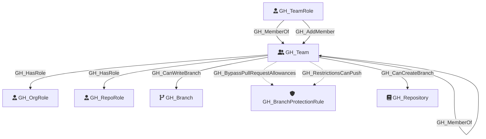

#  GH_Team

Represents a GitHub team within the organization. Teams can have parent-child relationships, contain members with different roles (Member, Maintainer), and be assigned to repository roles.

Created by: `Git-HoundTeam`

## Properties

| Property Name    | Data Type | Description                                                               |
| ---------------- | --------- | ------------------------------------------------------------------------- |
| objectid         | string    | The GitHub GraphQL `id` of the team, used as the unique graph identifier. |
| name             | string    | The team's display name, derived from the slug property.                  |
| id               | string    | The GraphQL ID of the team.                                               |
| node_id          | string    | The GitHub node ID. Redundant with objectid.                              |
| slug             | string    | The team's URL-safe slug identifier.                                      |
| description      | string    | The team's description.                                                   |
| privacy          | string    | The team's privacy level (e.g., `visible`, `secret`).                     |
| permission       | string    | The team's default permission on repositories.                            |
| environment_name | string    | The name of the environment (GitHub organization).                        |
| environmentid    | string    | The node_id of the environment (GitHub organization).                     |

## Diagram

