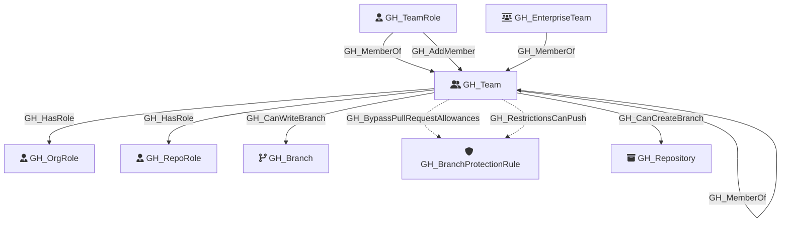

#  GH_Team

Represents a GitHub team within the organization. Teams can have parent-child relationships, contain members with different roles (Member, Maintainer), and be assigned to repository roles. Some teams are enterprise-projected `ent:` teams, which are linked back to `GH_EnterpriseTeam`.

Created by: `Git-HoundTeam`

## Properties

| Property Name    | Data Type | Description                                                               |
| ---------------- | --------- | ------------------------------------------------------------------------- |
| objectid         | string    | The GitHub team identifier used as the unique graph identifier. |
| name             | string    | The team's display name, derived from the slug property.                  |
| github_team_id   | string    | The raw GitHub team id when known.                                        |
| node_id          | string    | The GitHub team identifier. Redundant with objectid.                      |
| slug             | string    | The team's URL-safe slug identifier.                                      |
| description      | string    | The team's description.                                                   |
| privacy          | string    | The team's privacy level (e.g., `visible`, `secret`).                     |
| type             | string    | The team type. Enterprise-projected teams use `enterprise`.               |
| permission       | string    | The team's default permission on repositories.                            |
| environment_name | string    | The name of the environment (GitHub organization).                        |
| environmentid    | string    | The node_id of the environment (GitHub organization).                     |

## Diagram

