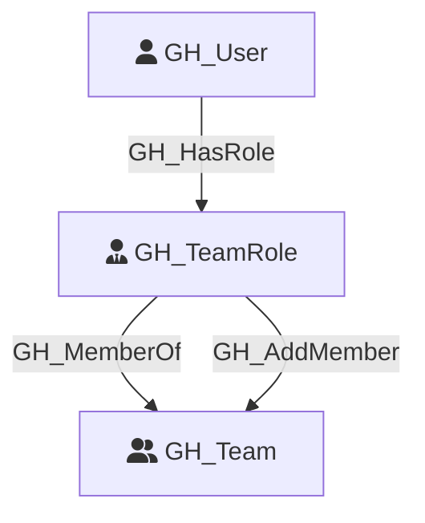

#  GH_TeamRole

Represents a role within a GitHub team. Each team has two built-in roles: Member and Maintainer. Maintainers can add and remove team members. Team roles connect users to teams and transitively to any repository roles assigned to the team.

Created by: `Git-HoundTeam`

## Properties

| Property Name    | Data Type | Description                                                                          |
| ---------------- | --------- | ------------------------------------------------------------------------------------ |
| objectid         | string    | A deterministic synthetic ID in the form `{teamId}_members` or `{teamId}_maintainers`. |
| name             | string    | The fully qualified role name (e.g., `OrgName/team-slug/members`).                   |
| id               | string    | Same as objectid.                                                                    |
| short_name       | string    | The short role name: `members` or `maintainers`.                                     |
| type             | string    | Always `default` for team roles.                                                     |
| environment_name | string    | The name of the environment (GitHub organization).                                   |
| environmentid    | string    | The node_id of the environment (GitHub organization).                                |

## Diagram

