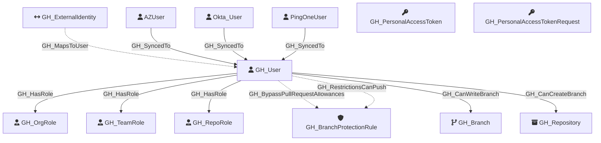

#  GH_User

Represents a GitHub user who is a member of the organization. Users are associated with organization roles (Owner or Member) and can be assigned to repository roles and team roles.

Created by: `Git-HoundUser`

## Properties

| Property Name    | Data Type | Description                                                            |
| ---------------- | --------- | ---------------------------------------------------------------------- |
| objectid         | string    | The GitHub `node_id` of the user, used as the unique graph identifier. |
| name             | string    | The user's display name, derived from the login property.              |
| login            | string    | The user's GitHub login handle.                                        |
| company          | string    | The company listed on the user's profile.                              |
| email            | string    | The user's public email address.                                       |
| full_name        | string    | The user's full name from their profile.                               |
| id               | integer   | The numeric GitHub ID of the user.                                     |
| node_id          | string    | The GitHub GraphQL node ID. Redundant with objectid.                   |
| environment_name | string    | The name of the environment (GitHub organization) the user belongs to. |
| environmentid    | string    | The node_id of the environment (GitHub organization).                  |

## Diagram

