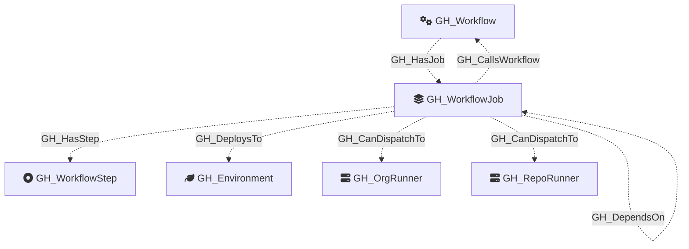

#  GH_WorkflowJob

Represents a single job within a GitHub Actions workflow. Jobs are the top-level execution units of a workflow — they run on a runner, hold a set of steps, and can declare permissions, environments, and dependencies on other jobs.

Created by: `Parse-GitHoundWorkflow`

## Properties

| Property Name    | Data Type | Description                                                                                       |
| ---------------- | --------- | ------------------------------------------------------------------------------------------------- |
| objectid         | string    | Synthetic ID derived from the parent workflow node_id and job key.                                |
| name             | string    | Fully qualified job name (`repoName\jobKey`).                                                     |
| node_id          | string    | Same as objectid — the synthetic job identifier.                                                  |
| job_key          | string    | The YAML key of the job (e.g., `build`, `deploy`).                                                |
| runs_on          | string    | The runner label(s) for the job (e.g., `ubuntu-latest`, `["self-hosted","linux"]`).               |
| container        | string    | Optional container image the job runs inside (JSON-serialized if a mapping).                      |
| environment      | string    | The GitHub Environment this job deploys to, if any.                                               |
| permissions      | string    | Effective GITHUB_TOKEN permissions for this job (JSON-serialized). Inherits workflow-level if not set. |
| uses_reusable    | string    | If this job calls a reusable workflow, the `uses:` reference (e.g., `org/repo/.github/workflows/ci.yml@main`). |
| workflow_node_id | string    | The objectid of the parent `GH_Workflow` node.                                                    |

## Diagram

