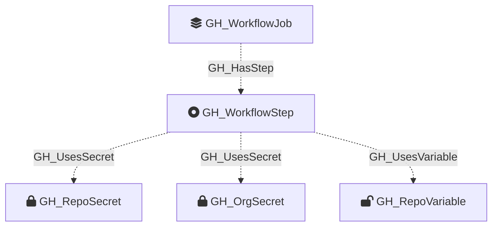

#  GH_WorkflowStep

Represents a single step within a GitHub Actions job. A step is either a `uses:` action reference or a `run:` shell command. Steps are the leaf nodes of the workflow execution tree and are the primary location where secrets and variables are consumed.

Created by: `Parse-GitHoundWorkflow`

## Properties

| Property Name    | Data Type | Description                                                                                             |
| ---------------- | --------- | ------------------------------------------------------------------------------------------------------- |
| objectid         | string    | Synthetic ID derived from the parent job objectid and step index.                                       |
| name             | string    | The step's `name:` value if set, otherwise the `uses:` action slug or a truncated `run:` snippet.      |
| node_id          | string    | Same as objectid — the synthetic step identifier.                                                       |
| step_index       | int       | Zero-based index of the step within its job.                                                            |
| type             | string    | Step type: `uses` (action reference), `run` (shell command), or `unknown`.                              |
| action           | string    | Full `uses:` value including owner, name, and ref (e.g., `actions/checkout@v4`).                        |
| action_slug      | string    | Owner and name without the ref (e.g., `actions/checkout`).                                              |
| action_owner     | string    | The owner portion of the action slug (e.g., `actions`).                                                 |
| action_name      | string    | The name portion of the action slug (e.g., `checkout`).                                                 |
| action_ref       | string    | The ref (tag, branch, or SHA) the action is pinned to.                                                  |
| is_pinned        | bool      | True if the action ref is a full 40-character commit SHA (immutable pin).                               |
| run              | string    | The shell script body if `type` is `run`.                                                               |
| auth_provider    | string    | Detected cloud auth provider if the step uses a known credential action (`AWS`, `Azure`, `GCP`, `Vault`, `Docker`). |
| injection_risks  | string    | JSON array of user-controlled expression references found in `run:` or `with:` blocks that may be injectable. |
| contents         | string    | Full step definition serialized as compact JSON (includes all keys: `uses`, `run`, `with`, `env`, etc.). |
| job_node_id      | string    | The objectid of the parent `GH_WorkflowJob` node.                                                       |

## Diagram

