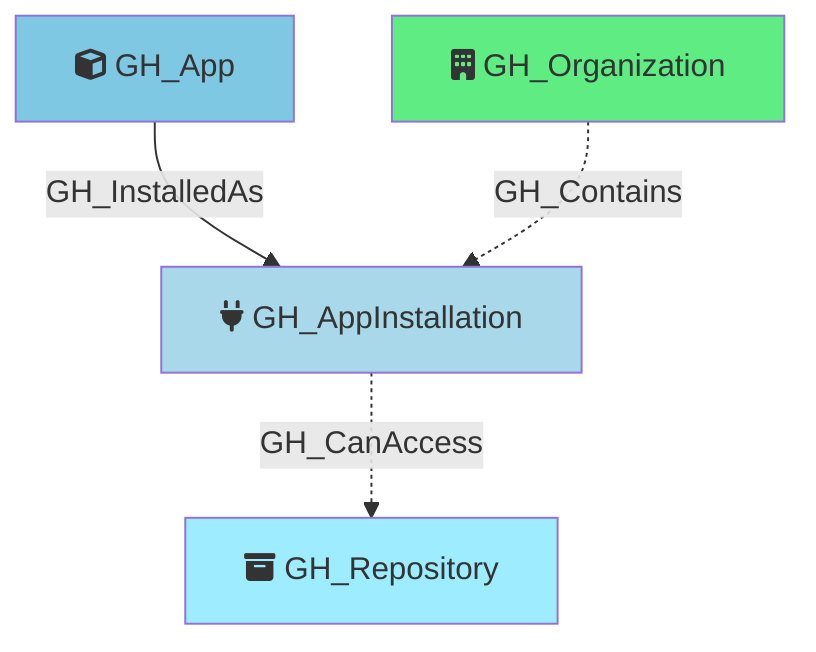

#  GH_App

Represents a GitHub App definition — the registered application entity. The app owner holds the private key that can generate installation access tokens for **every** `GH_AppInstallation` of this app. If the private key is compromised, all installations across all organizations are affected.

App definitions are retrieved via the public `GET /apps/{app_slug}` endpoint (no authentication required) after discovering unique app slugs from the organization's app installations.

Created by: `Git-HoundAppInstallation`

## Properties

| Property Name       | Data Type | Description                                                                    |
| ------------------- | --------- | ------------------------------------------------------------------------------ |
| objectid            | string    | Composite identifier: `GH_App_{appId}`.                                       |
| id                  | integer   | The GitHub App's numeric ID.                                                   |
| name                | string    | The display name of the app.                                                   |
| slug                | string    | The app's URL-friendly slug identifier.                                        |
| client_id           | string    | The app's OAuth client ID.                                                     |
| node_id             | string    | The app's GraphQL node ID.                                                     |
| description         | string    | The app's description.                                                         |
| external_url        | string    | The app's external homepage URL.                                               |
| html_url            | string    | URL to the app's GitHub page.                                                  |
| owner_login         | string    | The login of the user or organization that owns the app.                       |
| owner_node_id       | string    | The node_id of the user or organization that owns the app.                     |
| owner_type          | string    | The type of the owner (e.g., `User`, `Organization`).                          |
| created_at          | datetime  | When the app was created.                                                      |
| updated_at          | datetime  | When the app was last updated.                                                 |
| permissions         | string    | JSON string of the default permissions the app requests.                       |
| events              | string    | JSON string of the default webhook events the app subscribes to.               |
| installations_count | integer   | The total number of installations of this app across all organizations.        |

## Edges

### Outbound Edges

| Edge Name      | Target Node        | Traversable | Description                                                      |
| -------------- | ------------------ | ----------- | ---------------------------------------------------------------- |
| GH_InstalledAs | GH_AppInstallation | -->         | The app is installed as this installation on an organization.    |

### Inbound Edges

None

## Diagram

