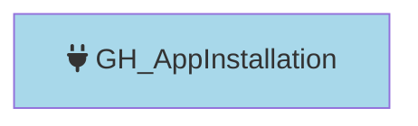

#  GH_AppInstallation

Represents a GitHub App installed on the organization. App installations have specific permissions and can be scoped to all repositories or a selection of repositories. The permissions granted to the app are captured as a JSON string in the properties.

Created by: `Git-HoundAppInstallation`

## Properties

| Property Name        | Data Type | Description                                                                                           |
| -------------------- | --------- | ----------------------------------------------------------------------------------------------------- |
| objectid             | string    | The app's `client_id`, used as the unique graph identifier.                                           |
| id                   | string    | The app's client ID.                                                                                  |
| name                 | string    | The app's slug identifier.                                                                            |
| environment_name     | string    | The name of the environment (GitHub organization) where the app is installed.                         |
| environment_id       | string    | The node_id of the environment (GitHub organization).                                                                      |
| repositories_url     | string    | API URL to list repositories accessible to this installation.                                         |
| repository_selection | string    | Whether the app has access to `all` repositories or `selected` repositories.                          |
| access_tokens_url    | string    | API URL to create installation access tokens.                                                         |
| description          | string    | The app's description.                                                                                |
| html_url             | string    | URL to the app's GitHub page.                                                                         |
| created_at           | datetime  | When the app was installed.                                                                           |
| updated_at           | datetime  | When the installation was last updated.                                                               |
| permissions          | string    | JSON string of the permissions granted to the app (e.g., `{"contents": "read", "metadata": "read"}`). |

## Edges

### Outbound Edges

None

### Inbound Edges

None

> **Note:** The GH_Contains edge from Organization to AppInstallation is currently commented out in the code.

## Diagram

