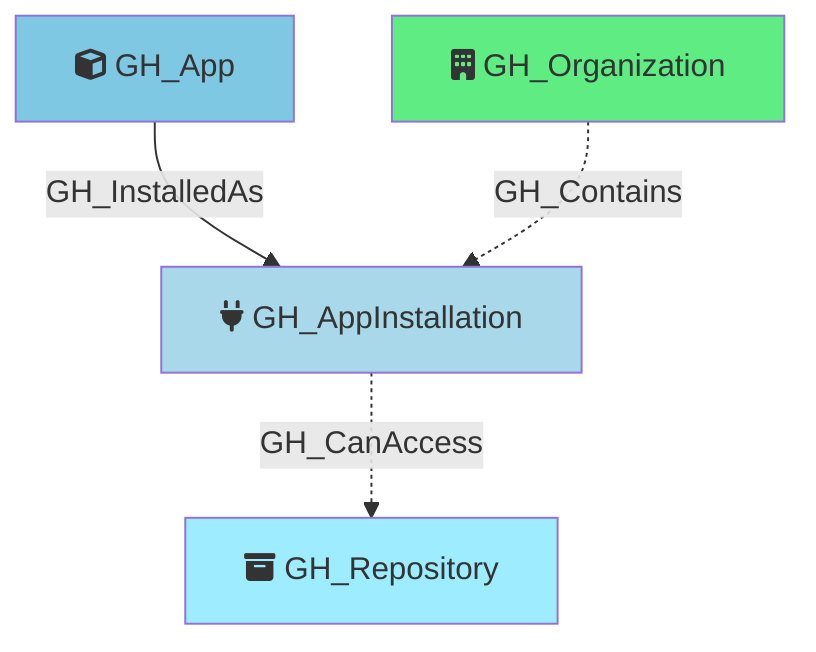

#  GH_AppInstallation

Represents a GitHub App installed on an organization. App installations have specific permissions and can be scoped to all repositories or a selection of repositories. The permissions granted to the app are captured as a JSON string in the properties.

Each installation is linked to its parent `GH_App` via a `GH_InstalledAs` edge. For installations with `repository_selection` set to `all`, `GH_CanAccess` edges are created to every repository in the organization. For installations with `repository_selection` set to `selected`, repository-level edges cannot be enumerated with a PAT (requires app installation token authentication).

Created by: `Git-HoundAppInstallation`

## Properties

| Property Name        | Data Type | Description                                                                                           |
| -------------------- | --------- | ----------------------------------------------------------------------------------------------------- |
| objectid             | string    | Composite identifier: `GH_AppInstallation_{orgNodeId}_{installationId}`.                              |
| id                   | integer   | The GitHub installation ID.                                                                           |
| name                 | string    | The app's slug identifier.                                                                            |
| environment_name     | string    | The name of the environment (GitHub organization) where the app is installed.                         |
| environment_id       | string    | The node_id of the environment (GitHub organization).                                                 |
| repositories_url     | string    | API URL to list repositories accessible to this installation.                                         |
| app_id               | integer   | The GitHub App's numeric ID (shared across all installations of the same app).                        |
| app_slug             | string    | The app's URL-friendly slug identifier.                                                               |
| repository_selection | string    | Whether the app has access to `all` repositories or `selected` repositories.                          |
| access_tokens_url    | string    | API URL to create installation access tokens.                                                         |
| target_type          | string    | The target type of the installation (e.g., `Organization`).                                           |
| description          | string    | The app's description.                                                                                |
| html_url             | string    | URL to the app's GitHub page.                                                                         |
| created_at           | datetime  | When the app was installed.                                                                           |
| updated_at           | datetime  | When the installation was last updated.                                                               |
| suspended_at         | datetime  | When the installation was suspended, if applicable.                                                   |
| permissions          | string    | JSON string of the permissions granted to the app (e.g., `{"contents": "read", "metadata": "read"}`). |
| events               | string    | JSON string of the webhook events the app subscribes to.                                              |

## Edges

### Outbound Edges

| Edge Name     | Target Node    | Traversable | Description                                                                        |
| ------------- | -------------- | ----------- | ---------------------------------------------------------------------------------- |
| GH_CanAccess  | GH_Repository  | -.->        | App installation can access this repository (created when `repository_selection` is `all`). |

### Inbound Edges

| Edge Name      | Source Node      | Traversable | Description                                                    |
| -------------- | ---------------- | ----------- | -------------------------------------------------------------- |
| GH_InstalledAs | GH_App           | -->         | The parent app definition that this installation belongs to.   |
| GH_Contains    | GH_Organization  | -.->        | The organization that contains this app installation.          |

## Diagram

