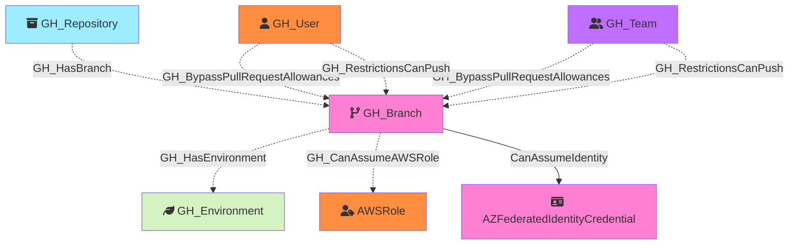

#  GH_Branch

Represents a Git branch within a repository. Branch nodes capture branch protection rule settings inline as properties, including requirements for pull request reviews, admin enforcement, push restrictions, and code owner reviews. Branches are connected to their parent repository and may have bypass/push allowance edges from users or teams.

Created by: `Git-HoundBranch`

## Properties

| Property Name                              | Data Type | Description                                                                  |
| ------------------------------------------ | --------- | ---------------------------------------------------------------------------- |
| objectid                                   | string    | A deterministic ID derived from the repository owner, name, and branch name. |
| name                                       | string    | The fully qualified branch name (e.g., `org/repo\main`).                     |
| short_name                                 | string    | The branch reference name (e.g., `main`).                                    |
| id                                         | string    | Same as objectid.                                                            |
| environment_name                           | string    | The name of the environment (GitHub organization).                           |
| environment_id                             | string    | The node_id of the environment (GitHub organization).                        |
| protected                                  | boolean   | Whether the branch has a protection rule.                                    |
| protection_enforce_admins                  | boolean   | Whether branch protection rules are enforced for administrators.             |
| protection_lock_branch                     | boolean   | Whether the branch is locked (read-only).                                    |
| protection_require_pull_request_reviews    | boolean   | Whether pull request reviews are required before merging.                    |
| protection_required_approving_review_count | integer   | The number of approving reviews required.                                    |
| protection_require_code_owner_reviews      | boolean   | Whether reviews from code owners are required.                               |
| protection_require_last_push_approval      | boolean   | Whether the last push must be approved by someone other than the pusher.     |
| protection_push_restrictions               | boolean   | Whether push access is restricted to specific users/teams.                   |

## Edges

### Outbound Edges

| Edge Kind         | Target Node                   | Traversable | Description                                                                                |
| ----------------- | ----------------------------- | ----------- | ------------------------------------------------------------------------------------------ |
| CanAssumeIdentity | AZFederatedIdentityCredential | Yes         | Branch can assume an Azure federated identity via OIDC (subject: ref:refs/heads/{branch}). |

### Inbound Edges

| Edge Kind                   | Source Node      | Traversable | Description                                                                               |
| --------------------------- | ---------------- | ----------- | ----------------------------------------------------------------------------------------- |
| GH_HasBranch                 | GH_Repository     | Yes         | Repository has this branch.                                                               |
| GHBypassRequiredPullRequest | GH_User or GH_Team | No          | User or team can bypass required pull request reviews on this branch.                     |
| GH_RestrictionsCanPush       | GH_User or GH_Team | No          | User or team is allowed to push to this restricted branch.                                |
| GH_HasEnvironment            | GH_Branch         | No          | Branch has a deployment environment via custom branch policy (from Git-HoundEnvironment). |

## Diagram

