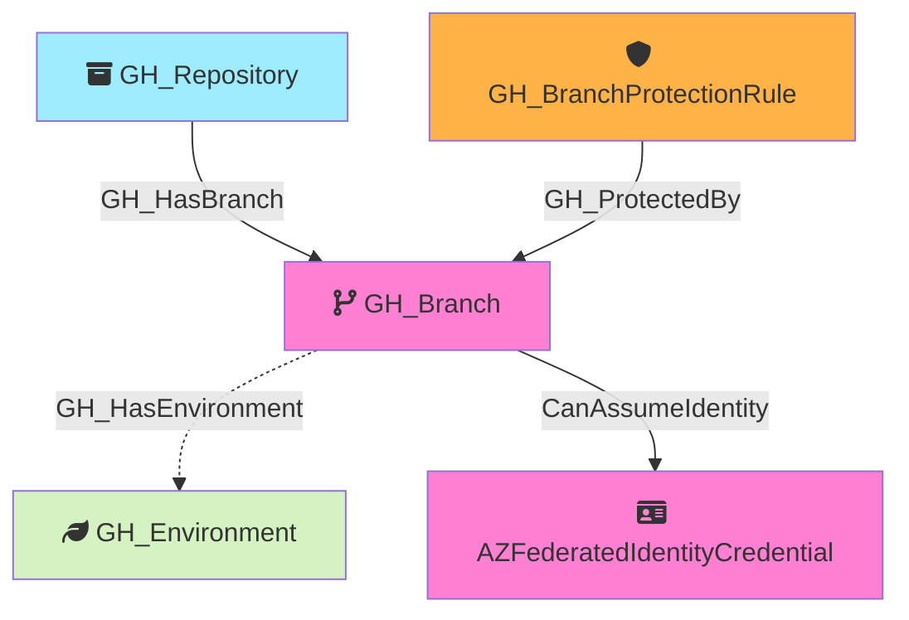

#  GH_Branch

Represents a Git branch within a repository. Branch nodes capture basic branch information and whether the branch is protected. Protection rule details are stored in separate `GH_BranchProtectionRule` nodes, linked via `GH_ProtectedBy` edges.

Created by: `Git-HoundBranch`

## Properties

| Property Name    | Data Type | Description                                                                  |
| ---------------- | --------- | ---------------------------------------------------------------------------- |
| objectid         | string    | A deterministic ID derived from the repository owner, name, and branch name. |
| name             | string    | The fully qualified branch name (e.g., `org/repo\main`).                     |
| short_name       | string    | The branch reference name (e.g., `main`).                                    |
| id               | string    | Same as objectid.                                                            |
| environment_name | string    | The name of the environment (GitHub organization).                           |
| environment_id   | string    | The node_id of the environment (GitHub organization).                        |
| protected        | boolean   | Whether the branch has a protection rule.                                    |

## Edges

### Outbound Edges

| Edge Kind         | Target Node                   | Traversable | Description                                                                                   |
| ----------------- | ----------------------------- | ----------- | --------------------------------------------------------------------------------------------- |
| GH_HasEnvironment | GH_Environment                | No          | Branch has a deployment environment via custom branch policy (from Git-HoundEnvironment).     |
| CanAssumeIdentity | AZFederatedIdentityCredential | Yes         | Branch can assume an Azure federated identity via OIDC (subject: `ref:refs/heads/{branch}`).  |

### Inbound Edges

| Edge Kind      | Source Node             | Traversable | Description                                  |
| -------------- | ----------------------- | ----------- | -------------------------------------------- |
| GH_HasBranch   | GH_Repository           | Yes         | Repository has this branch.                  |
| GH_ProtectedBy | GH_BranchProtectionRule | Yes         | Branch protection rule protects this branch. |

## Diagram

