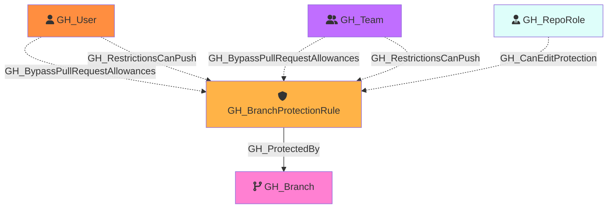

#  GH_BranchProtectionRule

Represents a branch protection rule configured on a GitHub repository. Protection rules define requirements that must be met before changes can be merged to matching branches, such as required reviews, status checks, and restrictions on who can push.

A single protection rule can apply to multiple branches via pattern matching (e.g., `main`, `release/*`).

Created by: `Git-HoundBranch`

## Properties

| Property Name                   | Data Type | Description                                                              |
| ------------------------------- | --------- | ------------------------------------------------------------------------ |
| objectid                        | string    | The GitHub node ID of the branch protection rule.                        |
| name                            | string    | Display name (e.g., `repo\main`).                                        |
| id                              | string    | Same as objectid.                                                        |
| pattern                         | string    | The branch name pattern this rule applies to (e.g., `main`, `release/*`).|
| enforce_admins                  | boolean   | Whether branch protection rules are enforced for administrators.         |
| lock_branch                     | boolean   | Whether the branch is locked (read-only).                                |
| blocks_creations                | boolean   | Whether creating branches matching this pattern is restricted. Only effective when `push_restrictions` is also `true`; silently reverts to `false` otherwise. |
| required_pull_request_reviews   | boolean   | Whether pull request reviews are required before merging.                |
| required_approving_review_count | integer   | The number of approving reviews required.                                |
| require_code_owner_reviews      | boolean   | Whether reviews from code owners are required.                           |
| require_last_push_approval      | boolean   | Whether the last push must be approved by someone other than the pusher. |
| push_restrictions               | boolean   | Whether push access is restricted to specific users/teams.               |
| requires_status_checks          | boolean   | Whether status checks must pass before merging.                          |
| requires_strict_status_checks   | boolean   | Whether branches must be up to date with the base branch before merging. |
| dismisses_stale_reviews         | boolean   | Whether new commits dismiss previously approved reviews.                 |
| allows_force_pushes             | boolean   | Whether force pushes are allowed to matching branches.                   |
| allows_deletions                | boolean   | Whether matching branches can be deleted.                                |

## Edges

### Outbound Edges

| Edge Kind      | Target Node | Traversable | Description                                |
| -------------- | ----------- | ----------- | ------------------------------------------ |
| GH_ProtectedBy | GH_Branch   | Yes         | Branch protection rule protects this branch. |

### Inbound Edges

| Edge Kind                      | Source Node        | Traversable | Description                                                         |
| ------------------------------ | ------------------ | ----------- | ------------------------------------------------------------------- |
| GH_BypassPullRequestAllowances | GH_User or GH_Team | No          | User or team can bypass pull request requirements on this rule.     |
| GH_RestrictionsCanPush         | GH_User or GH_Team | No          | User or team is allowed to push to branches protected by this rule. |
| GH_CanEditProtection           | GH_RepoRole        | No          | Repo role can modify or remove this branch protection rule (computed from `edit_repo_protections` or admin permission). |

## Diagram

## Security Considerations

Branch protection rules are critical security controls. Key settings to review:

- **enforce_admins**: Enforces merge-gate controls (PR reviews, lock branch) for admins and users with `bypass_branch_protection`. Does **not** enforce push-gate controls (`push_restrictions`) for admins or users with `push_protected_branch`.
- **required_pull_request_reviews**: Blocks direct pushes to existing protected branches. Bypassed by `GH_BypassBranchProtection` and `GH_BypassPullRequestAllowances` (both suppressed by `enforce_admins`).
- **push_restrictions**: Restricts who can push. Bypassed by `GH_PushProtectedBranch`, `GH_AdminTo`, and `GH_RestrictionsCanPush` (none suppressed by `enforce_admins`).
- **blocks_creations**: Restricts new branch creation when `push_restrictions` is also `true`. Same bypass vectors as `push_restrictions`. Silently reverts to `false` if `push_restrictions` is disabled.
- **lock_branch**: Makes branch read-only. Bypassed by `GH_BypassBranchProtection` (suppressed by `enforce_admins`).
- **require_code_owner_reviews**: If `false`, changes to critical paths may not require owner approval.
- **allows_force_pushes**: Controls whether history rewrites are allowed. Does **not** grant push access — it is not a bypass mechanism.
- **allows_deletions**: If `true`, branches can be deleted (potentially losing code).

### Secret Exfiltration Mitigation

The only branch protection configuration that blocks the write-access → workflow → secrets exfiltration attack path is `push_restrictions` + `blocks_creations` on a `*` pattern rule. However, users with `GH_PushProtectedBranch`, `GH_AdminTo`, `GH_RestrictionsCanPush`, or `GH_EditRepoProtections` can bypass this control.

For complete analysis, see [MITIGATING_CONTROLS.md](../MITIGATING_CONTROLS.md).

### Identifying Bypass Actors

Use these edges to identify users and teams with elevated branch permissions:
- `GH_BypassPullRequestAllowances` — can bypass PR requirements on a specific rule (PR reviews only)
- `GH_RestrictionsCanPush` — can push despite push restrictions on a specific rule
- `GH_BypassBranchProtection` — repo-wide bypass of merge-gate controls (PR reviews + lock branch)
- `GH_PushProtectedBranch` — repo-wide bypass of push-gate controls (push restrictions + blocks creations)
- `GH_EditRepoProtections` — can remove/modify protection rules entirely
