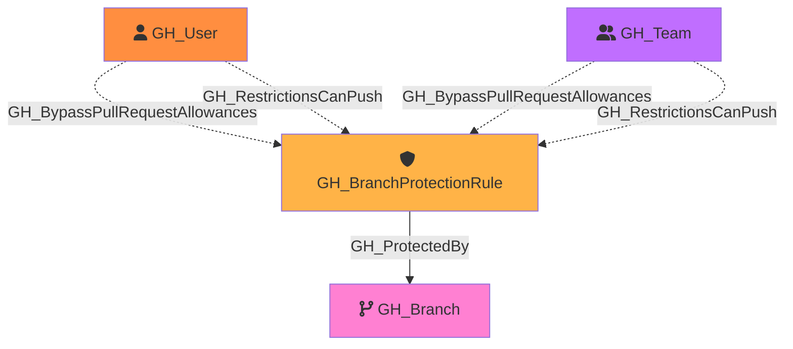

#  GH_BranchProtectionRule

Represents a branch protection rule configured on a GitHub repository. Protection rules define requirements that must be met before changes can be merged to matching branches, such as required reviews, status checks, and restrictions on who can push.

A single protection rule can apply to multiple branches via pattern matching (e.g., `main`, `release/*`).

Created by: `Git-HoundBranchProtection`

## Properties

| Property Name                   | Data Type | Description                                                              |
| ------------------------------- | --------- | ------------------------------------------------------------------------ |
| objectid                        | string    | The GitHub node ID of the branch protection rule.                        |
| name                            | string    | Display name (e.g., `repo\main`).                                        |
| id                              | string    | Same as objectid.                                                        |
| pattern                         | string    | The branch name pattern this rule applies to (e.g., `main`, `release/*`).|
| enforce_admins                  | boolean   | Whether branch protection rules are enforced for administrators.         |
| lock_branch                     | boolean   | Whether the branch is locked (read-only).                                |
| required_pull_request_reviews   | boolean   | Whether pull request reviews are required before merging.                |
| required_approving_review_count | integer   | The number of approving reviews required.                                |
| require_code_owner_reviews      | boolean   | Whether reviews from code owners are required.                           |
| require_last_push_approval      | boolean   | Whether the last push must be approved by someone other than the pusher. |
| push_restrictions               | boolean   | Whether push access is restricted to specific users/teams.               |
| requires_status_checks          | boolean   | Whether status checks must pass before merging.                          |
| requires_strict_status_checks   | boolean   | Whether branches must be up to date with the base branch before merging. |
| dismisses_stale_reviews         | boolean   | Whether new commits dismiss previously approved reviews.                 |
| allows_force_pushes             | boolean   | Whether force pushes are allowed to matching branches.                   |
| allows_deletions                | boolean   | Whether matching branches can be deleted.                                |

## Edges

### Outbound Edges

| Edge Kind      | Target Node | Traversable | Description                                |
| -------------- | ----------- | ----------- | ------------------------------------------ |
| GH_ProtectedBy | GH_Branch   | Yes         | Branch protection rule protects this branch. |

### Inbound Edges

| Edge Kind                      | Source Node        | Traversable | Description                                                         |
| ------------------------------ | ------------------ | ----------- | ------------------------------------------------------------------- |
| GH_BypassPullRequestAllowances | GH_User or GH_Team | No          | User or team can bypass pull request requirements on this rule.     |
| GH_RestrictionsCanPush         | GH_User or GH_Team | No          | User or team is allowed to push to branches protected by this rule. |

## Diagram

## Security Considerations

Branch protection rules are critical security controls. Key settings to review:

- **enforce_admins**: If `false`, repository administrators can bypass all protections
- **required_pull_request_reviews**: If `false`, code can be merged without review
- **require_code_owner_reviews**: If `false`, changes to critical paths may not require owner approval
- **allows_force_pushes**: If `true`, commit history can be rewritten
- **allows_deletions**: If `true`, branches can be deleted (potentially losing code)

Use the `GH_BypassPullRequestAllowances` and `GH_RestrictionsCanPush` edges to identify users and teams with elevated branch permissions.
