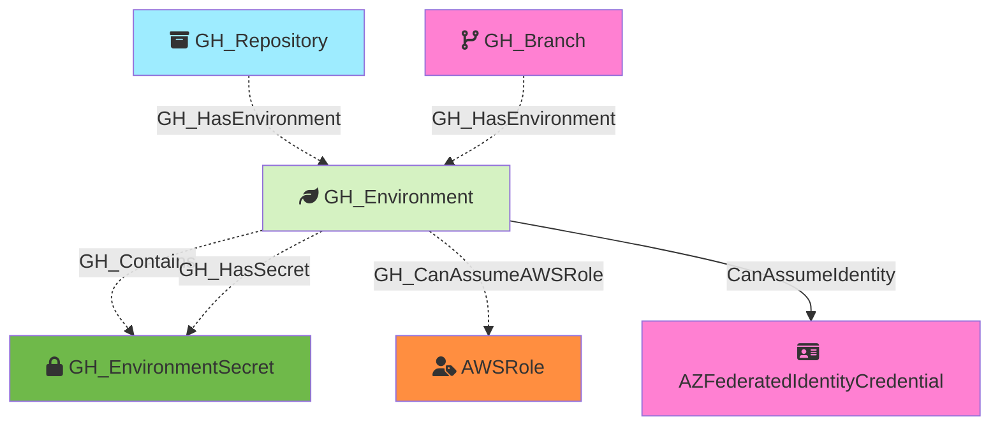

#  GH_Environment

Represents a GitHub Actions deployment environment configured on a repository. Environments can have protection rules including required reviewers, wait timers, and deployment branch policies. When custom branch policies are configured, the environment is connected to specific branches; otherwise, it is connected directly to the repository.

Created by: `Git-HoundEnvironment`

## Properties

| Property Name     | Data Type | Description                                                                   |
| ----------------- | --------- | ----------------------------------------------------------------------------- |
| objectid          | string    | The GitHub `node_id` of the environment, used as the unique graph identifier. |
| id                | integer   | The numeric GitHub ID of the environment.                                     |
| node_id           | string    | The GitHub node ID. Redundant with objectid.                                  |
| name              | string    | The fully qualified environment name (e.g., `repoName\production`).           |
| short_name        | string    | The environment's display name (e.g., `production`, `staging`).               |
| can_admins_bypass | boolean   | Whether repository administrators can bypass environment protection rules.    |
| environment_name  | string    | The name of the environment (GitHub organization)                             |
| environment_id    | string    | The node_id of the environment (GitHub organization)                          |
| repository_name   | string    | The full name of the containing repository.                                   |
| repository_id     | string    | The ID of the containing repository.                                          |

## Edges

### Outbound Edges

| Edge Kind         | Target Node                   | Traversable | Description                                                                          |
| ----------------- | ----------------------------- | ----------- | ------------------------------------------------------------------------------------ |
| GH_Contains        | GH_EnvironmentSecret           | No          | Environment contains an environment-level secret.                                    |
| GH_HasSecret       | GH_EnvironmentSecret           | No          | Environment has an environment-level secret.                                         |
| CanAssumeIdentity | AZFederatedIdentityCredential | Yes         | Environment can assume an Azure federated identity via OIDC (subject: environment:{envName}). |

### Inbound Edges

| Edge Kind        | Source Node  | Traversable | Description                                                                 |
| ---------------- | ------------ | ----------- | --------------------------------------------------------------------------- |
| GH_HasEnvironment | GH_Repository | Yes         | Repository has this environment (when no custom branch policies).           |
| GH_HasEnvironment | GH_Branch     | No          | Branch is allowed to deploy to this environment (via custom branch policy). |

## Diagram

