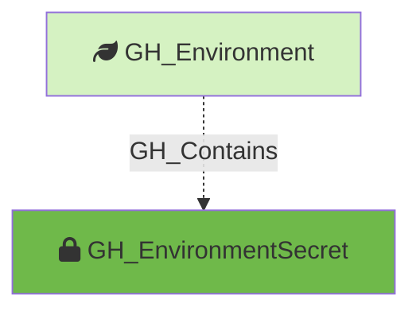

#  GH_EnvironmentSecret

Represents an environment-level GitHub Actions secret. These secrets are scoped to a specific deployment environment and are only available to workflow jobs that reference that environment.

Created by: `Git-HoundEnvironment`

## Properties

| Property Name               | Data Type | Description                                                                      |
| --------------------------- | --------- | -------------------------------------------------------------------------------- |
| objectid                    | string    | A deterministic ID in the format `GH_EnvironmentSecret_{envNodeId}_{secretName}`. |
| id                          | string    | Same as objectid.                                                                |
| name                        | string    | The name of the secret.                                                          |
| environment_name            | string    | The name of the environment (GitHub organization)                                |
| environment_id              | string    | The node_id of the environment (GitHub organization)                             |
| deployment_environment_name | string    | The name of the containing deployment environment.                               |
| deployment_environment_id   | string    | The node_id of the containing deployment environment.                            |
| created_at                  | datetime  | When the secret was created.                                                     |
| updated_at                  | datetime  | When the secret was last updated.                                                |

## Edges

### Outbound Edges

None

### Inbound Edges

| Edge Kind   | Source Node   | Traversable | Description                       |
| ----------- | ------------- | ----------- | --------------------------------- |
| GH_Contains  | GH_Environment | No          | Environment contains this secret. |

## Diagram

