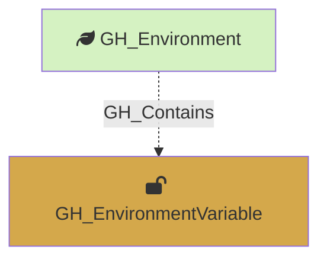

#  GH_EnvironmentVariable

Represents an environment-level GitHub Actions variable. These variables are scoped to a specific deployment environment and are only available to workflow jobs that reference that environment. Unlike secrets, variable values are readable via the API.

Created by: `Git-HoundEnvironment`

## Properties

| Property Name               | Data Type | Description                                                                         |
| --------------------------- | --------- | ----------------------------------------------------------------------------------- |
| objectid                    | string    | A deterministic ID in the format `GH_EnvironmentVariable_{envNodeId}_{variableName}`. |
| id                          | string    | Same as objectid.                                                                   |
| name                        | string    | The name of the variable.                                                           |
| environment_name            | string    | The name of the environment (GitHub organization).                                  |
| environment_id              | string    | The node_id of the environment (GitHub organization).                               |
| repository_name             | string    | The name of the containing repository.                                              |
| repository_id               | string    | The node_id of the containing repository.                                           |
| deployment_environment_name | string    | The name of the containing deployment environment.                                  |
| deployment_environment_id   | string    | The node_id of the containing deployment environment.                               |
| value                       | string    | The plaintext value of the variable.                                                |
| created_at                  | datetime  | When the variable was created.                                                      |
| updated_at                  | datetime  | When the variable was last updated.                                                 |

## Edges

### Outbound Edges

None

### Inbound Edges

| Edge Kind   | Source Node     | Traversable | Description                         |
| ----------- | --------------- | ----------- | ----------------------------------- |
| GH_Contains | GH_Environment  | No          | Environment contains this variable. |

## Diagram

