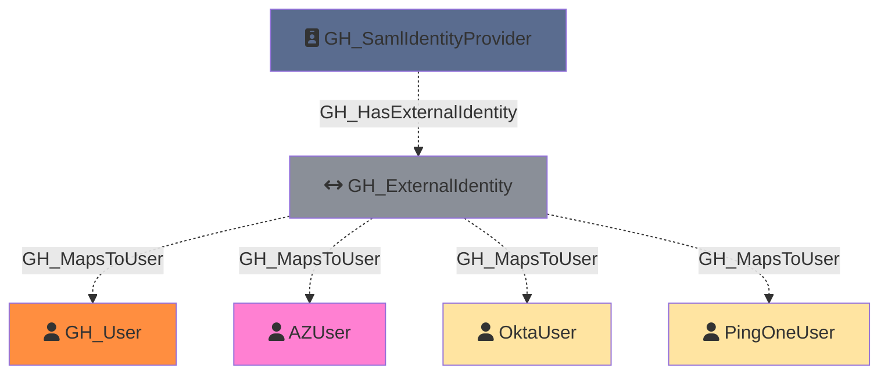

#  GH_ExternalIdentity

Represents an external identity from a SAML or SCIM identity provider that is linked to a GitHub user. External identities map corporate user accounts (from providers like Okta, Azure AD, etc.) to GitHub user accounts, enabling single sign-on authentication. Each external identity can have both SAML and SCIM identity attributes.

Created by: `Git-HoundGraphQlSamlProvider`

## Properties

| Property Name             | Data Type | Description                                |
| ------------------------- | --------- | ------------------------------------------ |
| objectid                  | string    | The GraphQL ID of the external identity.   |
| name                      | string    | Same as objectid.                          |
| guid                      | string    | The GUID of the external identity.         |
| environment_id            | string    | The GraphQL ID of the environment (GitHub organization). |
| environment_name          | string    | The name of the environment (GitHub organization).       |
| saml_identity_family_name | string    | The family name from the SAML identity.    |
| saml_identity_given_name  | string    | The given name from the SAML identity.     |
| saml_identity_name_id     | string    | The SAML NameID attribute.                 |
| saml_identity_username    | string    | The username from the SAML identity.       |
| scim_identity_family_name | string    | The family name from the SCIM identity.    |
| scim_identity_given_name  | string    | The given name from the SCIM identity.     |
| scim_identity_username    | string    | The username from the SCIM identity.       |
| github_username           | string    | The GitHub login of the linked user.       |
| github_user_id            | string    | The GraphQL ID of the linked GitHub user.  |

## Edges

### Outbound Edges

| Edge Kind    | Target Node       | Traversable | Description                                                                         |
| ------------ | ----------------- | ----------- | ----------------------------------------------------------------------------------- |
| GH_MapsToUser | GH_User            | No          | External identity maps to a GitHub user (via GitHub user ID).                       |
| GH_MapsToUser | Foreign User Node | No          | External identity maps to a user in a foreign environment (via SAML/SCIM username). |

### Inbound Edges

| Edge Kind             | Source Node            | Traversable | Description                                        |
| --------------------- | ---------------------- | ----------- | -------------------------------------------------- |
| GH_HasExternalIdentity | GH_SamlIdentityProvider | No          | SAML identity provider has this external identity. |

## Diagram

