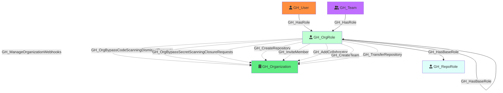

#  GH_OrgRole

Represents an organization-level role such as Owner, Member, or a custom organization role. Org roles define what permissions a user or team has at the organization level. The Owner and Member roles are default (built-in), while custom roles inherit from a base role and can have additional permissions.

Created by: `Git-HoundOrganization`

## Properties

| Property Name     | Data Type | Description                                                                              |
| ----------------- | --------- | ---------------------------------------------------------------------------------------- |
| objectid          | string    | A deterministic ID derived from the organization ID and role name.                       |
| name              | string    | The fully qualified role name (e.g., `OrgName\Owners`).                                  |
| id                | string    | Same as objectid.                                                                        |
| short_name        | string    | The short display name of the role (e.g., `Owners`, `Members`, or the custom role name). |
| type              | string    | `default` for built-in roles (Owner, Member) or `custom` for custom organization roles.  |
| environment_name  | string    | The name of the environment (GitHub organization).                                       |
| environment_id    | string    | The node_id of the environment (GitHub organization).                                    |

## Edges

### Outbound Edges

| Edge Kind                                         | Target Node    | Traversable | Description                                                                                        |
| ------------------------------------------------- | -------------- | ----------- | -------------------------------------------------------------------------------------------------- |
| GH_CreateRepository                                | GH_Organization | No          | Role can create repositories in the organization.                                                  |
| GH_InviteMember                                    | GH_Organization | No          | Role can invite members (Owners only).                                                             |
| GH_AddCollaborator                                 | GH_Organization | No          | Role can add outside collaborators (Owners only).                                                  |
| GH_CreateTeam                                      | GH_Organization | No          | Role can create teams.                                                                             |
| GH_TransferRepository                              | GH_Organization | No          | Role can transfer repositories (Owners only).                                                      |
| GH_HasBaseRole                                     | GH_RepoRole     | Yes         | Role inherits access to all repositories via an `all_repo_*` role (e.g., Owners → all_repo_admin). |
| GH_HasBaseRole                                     | GH_OrgRole      | Yes         | Custom role inherits from a base org role.                                                         |
| GH_ManageOrganizationWebhooks                      | GH_Organization | No          | Custom role permission.                                                                            |
| GH_WriteOrganizationActionsSecrets                       | GH_Organization | No          | Custom role permission.                                                                            |
| GH_WriteOrganizationActionsSettings                      | GH_Organization | No          | Custom role permission.                                                                            |
| GH_ViewSecretScanningAlerts                              | GH_Organization | No          | Custom role permission.                                                                            |
| GH_ResolveSecretScanningAlerts                           | GH_Organization | No          | Custom role permission.                                                                            |
| GH_ReadOrganizationActionsUsageMetrics                   | GH_Organization | No          | Custom role permission.                                                                            |
| GH_ReadOrganizationCustomOrgRole                         | GH_Organization | No          | Custom role permission.                                                                            |
| GH_ReadOrganizationCustomRepoRole                        | GH_Organization | No          | Custom role permission.                                                                            |
| GH_WriteOrganizationCustomOrgRole                        | GH_Organization | No          | Custom role permission.                                                                            |
| GH_WriteOrganizationCustomRepoRole                       | GH_Organization | No          | Custom role permission.                                                                            |
| GH_WriteOrganizationNetworkConfigurations                | GH_Organization | No          | Custom role permission.                                                                            |
| GH_OrgBypassCodeScanningDismissalRequests                | GH_Organization | No          | Custom role permission.                                                                            |
| GH_OrgBypassSecretScanningClosureRequests                | GH_Organization | No          | Custom role permission.                                                                            |
| GH_OrgReviewAndManageSecretScanningBypassRequests        | GH_Organization | No          | Custom role permission.                                                                            |
| GH_OrgReviewAndManageSecretScanningClosureRequests       | GH_Organization | No          | Custom role permission.                                                                            |

### Inbound Edges

| Edge Kind | Source Node | Traversable | Description                                          |
| --------- | ----------- | ----------- | ---------------------------------------------------- |
| GH_HasRole | GH_User      | Yes         | A user is assigned to this organization role.        |
| GH_HasRole | GH_Team      | Yes         | A team is assigned to this custom organization role. |

## Diagram

