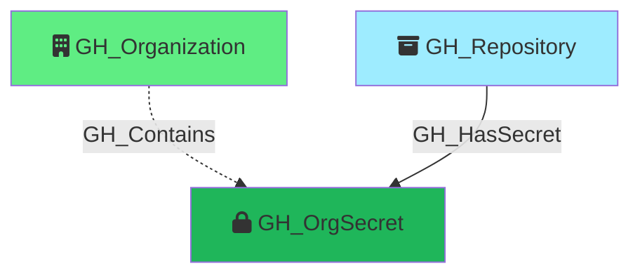

#  GH_OrgSecret

Represents an organization-level GitHub Actions secret. Organization secrets can be scoped to all repositories, only private/internal repositories, or a specific set of selected repositories. The visibility property determines how GH_HasSecret edges are resolved to repository nodes.

Created by: `Git-HoundOrganizationSecret`

## Properties

| Property Name     | Data Type | Description                                                                                                               |
| ----------------- | --------- | ------------------------------------------------------------------------------------------------------------------------- |
| objectid          | string    | A deterministic ID in the format `GH_OrgSecret_{orgNodeId}_{secretName}`.                                                  |
| id                | string    | Same as objectid.                                                                                                         |
| name              | string    | The name of the secret.                                                                                                   |
| environment_name  | string    | The name of the environment (GitHub organization).                                                                        |
| environment_id    | string    | The node_id of the environment (GitHub organization).                                                                                   |
| created_at        | datetime  | When the secret was created.                                                                                              |
| updated_at        | datetime  | When the secret was last updated.                                                                                         |
| visibility        | string    | The secret's visibility scope: `all` (all repos), `private` (private and internal repos), or `selected` (specific repos). |

## Edges

### Outbound Edges

None

### Inbound Edges

| Edge Kind   | Source Node    | Traversable | Description                                                                 |
| ----------- | -------------- | ----------- | --------------------------------------------------------------------------- |
| GH_Contains  | GH_Organization | No          | Organization contains this secret.                                          |
| GH_HasSecret | GH_Repository   | Yes         | Repository has access to this organization secret (resolved by visibility). Traversable because any user with write access to the repository can access org secrets scoped to that repo by creating a GitHub Actions workflow. |

## Diagram

