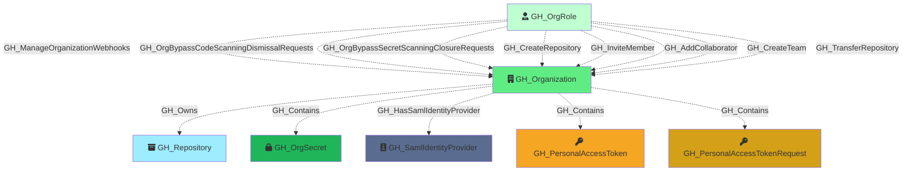

#  GH_Organization

Represents a GitHub organization. This is the root node of the graph and serves as the primary container for all other nodes. Organization-level settings such as default repository permissions, Actions configuration, and security features are captured as properties on this node.

Created by: `Git-HoundOrganization`

## Properties

| Property Name                                              | Data Type | Description                                                                                                                                                                                   |
| ---------------------------------------------------------- | --------- | --------------------------------------------------------------------------------------------------------------------------------------------------------------------------------------------- |
| objectid                                                   | string    | The GitHub `node_id` of the organization, used as the unique graph identifier.                                                                                                                |
| id                                                         | integer   | The numeric GitHub ID of the organization.                                                                                                                                                    |
| name                                                       | string    | The organization's login handle, used as the display name.                                                                                                                                    |
| login                                                      | string    | The organization's login handle (URL slug).                                                                                                                                                   |
| node_id                                                    | string    | The GitHub GraphQL node ID. Redundant with objectid.                                                                                                                                          |
| description                                                | string    | The organization's description.                                                                                                                                                               |
| org_name                                                   | string    | The organization's display name (from the `name` field in the GitHub API).                                                                                                                    |
| company                                                    | string    | The company associated with the organization.                                                                                                                                                 |
| blog                                                       | string    | The organization's blog URL.                                                                                                                                                                  |
| location                                                   | string    | The organization's location.                                                                                                                                                                  |
| email                                                      | string    | The organization's public email address.                                                                                                                                                      |
| is_verified                                                | boolean   | Whether the organization's domain is verified by GitHub.                                                                                                                                      |
| has_organization_projects                                  | boolean   | Whether the organization has projects enabled.                                                                                                                                                |
| has_repository_projects                                    | boolean   | Whether repository projects are enabled.                                                                                                                                                      |
| public_repos                                               | integer   | Number of public repositories in the organization.                                                                                                                                            |
| public_gists                                               | integer   | Number of public gists.                                                                                                                                                                       |
| followers                                                  | integer   | Number of followers the organization has.                                                                                                                                                     |
| following                                                  | integer   | Number of accounts the organization is following.                                                                                                                                             |
| html_url                                                   | string    | URL to the organization's GitHub profile page.                                                                                                                                                |
| created_at                                                 | datetime  | When the organization was created.                                                                                                                                                            |
| updated_at                                                 | datetime  | When the organization was last updated.                                                                                                                                                       |
| type                                                       | string    | The account type (e.g., `Organization`).                                                                                                                                                      |
| total_private_repos                                        | integer   | Total number of private repositories.                                                                                                                                                         |
| owned_private_repos                                        | integer   | Number of private repositories owned directly by the organization.                                                                                                                            |
| private_gists                                              | integer   | Number of private gists.                                                                                                                                                                      |
| collaborators                                              | integer   | Number of outside collaborators across the organization.                                                                                                                                      |
| default_repository_permission                              | string    | Default permission level granted to members on all repositories (e.g., `read`, `write`, `admin`, `none`). Used to associate the Members org role with the appropriate `all_repo_*` role node. |
| members_can_create_repositories                            | boolean   | Whether members can create repositories.                                                                                                                                                      |
| two_factor_requirement_enabled                             | boolean   | Whether two-factor authentication is required for all members.                                                                                                                                |
| members_can_create_public_repositories                     | boolean   | Whether members can create public repositories.                                                                                                                                               |
| members_can_create_private_repositories                    | boolean   | Whether members can create private repositories.                                                                                                                                              |
| members_can_create_internal_repositories                   | boolean   | Whether members can create internal repositories.                                                                                                                                             |
| members_can_create_pages                                   | boolean   | Whether members can create GitHub Pages sites.                                                                                                                                                |
| members_can_fork_private_repositories                      | boolean   | Whether members can fork private repositories.                                                                                                                                                |
| web_commit_signoff_required                                | boolean   | Whether web-based commits require sign-off.                                                                                                                                                   |
| deploy_keys_enabled_for_repositories                       | string    | Which repositories allow deploy keys.                                                                                                                                                         |
| members_can_delete_repositories                            | boolean   | Whether members can delete repositories.                                                                                                                                                      |
| members_can_change_repo_visibility                         | boolean   | Whether members can change repository visibility.                                                                                                                                             |
| members_can_invite_outside_collaborators                   | boolean   | Whether members can invite outside collaborators.                                                                                                                                             |
| members_can_delete_issues                                  | boolean   | Whether members can delete issues.                                                                                                                                                            |
| display_commenter_full_name_setting_enabled                | boolean   | Whether commenter full names are displayed.                                                                                                                                                   |
| readers_can_create_discussions                             | boolean   | Whether readers can create discussions.                                                                                                                                                       |
| members_can_create_teams                                   | boolean   | Whether members can create teams.                                                                                                                                                             |
| members_can_view_dependency_insights                       | boolean   | Whether members can view dependency insights.                                                                                                                                                 |
| default_repository_branch                                  | string    | The default branch name for new repositories.                                                                                                                                                 |
| members_can_create_public_pages                            | boolean   | Whether members can create public GitHub Pages sites.                                                                                                                                         |
| members_can_create_private_pages                           | boolean   | Whether members can create private GitHub Pages sites.                                                                                                                                        |
| advanced_security_enabled_for_new_repositories             | boolean   | Whether GitHub Advanced Security is automatically enabled for new repositories.                                                                                                               |
| dependabot_alerts_enabled_for_new_repositories             | boolean   | Whether Dependabot alerts are enabled for new repositories.                                                                                                                                   |
| dependabot_security_updates_enabled_for_new_repositories   | boolean   | Whether Dependabot security updates are enabled for new repositories.                                                                                                                         |
| dependency_graph_enabled_for_new_repositories              | boolean   | Whether the dependency graph is enabled for new repositories.                                                                                                                                 |
| secret_scanning_enabled_for_new_repositories               | boolean   | Whether secret scanning is enabled for new repositories.                                                                                                                                      |
| secret_scanning_push_protection_enabled_for_new_repositories | boolean | Whether secret scanning push protection is enabled for new repositories.                                                                                                                      |
| secret_scanning_push_protection_custom_link_enabled        | boolean   | Whether a custom link is enabled for secret scanning push protection.                                                                                                                         |
| secret_scanning_push_protection_custom_link                | boolean   | The custom link for secret scanning push protection.                                                                                                                                          |
| secret_scanning_validity_checks_enabled                    | boolean   | Whether secret scanning validity checks are enabled.                                                                                                                                          |
| actions_enabled_repositories                               | string    | Which repositories have GitHub Actions enabled: `all`, `selected`, or `none`.                                                                                                                 |
| actions_allowed_actions                                    | string    | Which Actions are allowed to run: `all`, `local_only`, or `selected`.                                                                                                                         |
| actions_sha_pinning_required                               | boolean   | Whether SHA pinning is required for GitHub Actions.                                                                                                                                           |

## Edges

### Outbound Edges

| Edge Kind                 | Target Node                      | Traversable | Description                                                      |
| ------------------------- | -------------------------------- | ----------- | ---------------------------------------------------------------- |
| GH_Contains                | GH_OrgSecret                     | No          | Organization contains an organization-level Actions secret.      |
| GH_HasSamlIdentityProvider | GH_SamlIdentityProvider          | No          | Organization has a configured SAML identity provider.            |
| GH_Contains                | GH_PersonalAccessToken           | No          | Organization contains a granted fine-grained personal access token. |
| GH_Contains                | GH_PersonalAccessTokenRequest    | No          | Organization contains a pending personal access token request.   |

### Inbound Edges

| Edge Kind                                         | Source Node | Traversable | Description                                                             |
| ------------------------------------------------- | ----------- | ----------- | ----------------------------------------------------------------------- |
| GH_CreateRepository                                | GH_OrgRole   | No          | Org role has permission to create repositories.                         |
| GH_InviteMember                                    | GH_OrgRole   | No          | Org role has permission to invite members.                              |
| GH_AddCollaborator                                 | GH_OrgRole   | No          | Org role has permission to add outside collaborators.                   |
| GH_CreateTeam                                      | GH_OrgRole   | No          | Org role has permission to create teams.                                |
| GH_TransferRepository                              | GH_OrgRole   | No          | Org role has permission to transfer repositories.                       |
| GH_ManageOrganizationWebhooks                      | GH_OrgRole   | No          | Custom org role can manage organization webhooks.                       |
| GH_WriteOrganizationActionsSecrets                       | GH_OrgRole   | No          | Custom org role can write Actions secrets.                              |
| GH_WriteOrganizationActionsSettings                      | GH_OrgRole   | No          | Custom org role can write Actions settings.                             |
| GH_ViewSecretScanningAlerts                              | GH_OrgRole   | No          | Custom org role can view secret scanning alerts.                        |
| GH_ResolveSecretScanningAlerts                           | GH_OrgRole   | No          | Custom org role can resolve secret scanning alerts.                     |
| GH_ReadOrganizationActionsUsageMetrics                   | GH_OrgRole   | No          | Custom org role can read Actions usage metrics.                         |
| GH_ReadOrganizationCustomOrgRole                         | GH_OrgRole   | No          | Custom org role can read custom org role definitions.                   |
| GH_ReadOrganizationCustomRepoRole                        | GH_OrgRole   | No          | Custom org role can read custom repo role definitions.                  |
| GH_WriteOrganizationCustomOrgRole                        | GH_OrgRole   | No          | Custom org role can write custom org role definitions.                  |
| GH_WriteOrganizationCustomRepoRole                       | GH_OrgRole   | No          | Custom org role can write custom repo role definitions.                 |
| GH_WriteOrganizationNetworkConfigurations                | GH_OrgRole   | No          | Custom org role can write network configurations.                       |
| GH_OrgBypassCodeScanningDismissalRequests                | GH_OrgRole   | No          | Custom org role can bypass code scanning dismissal requests.            |
| GH_OrgBypassSecretScanningClosureRequests                | GH_OrgRole   | No          | Custom org role can bypass secret scanning closure requests.            |
| GH_OrgReviewAndManageSecretScanningBypassRequests        | GH_OrgRole   | No          | Custom org role can review and manage secret scanning bypass requests.  |
| GH_OrgReviewAndManageSecretScanningClosureRequests       | GH_OrgRole   | No          | Custom org role can review and manage secret scanning closure requests. |

## Diagram

