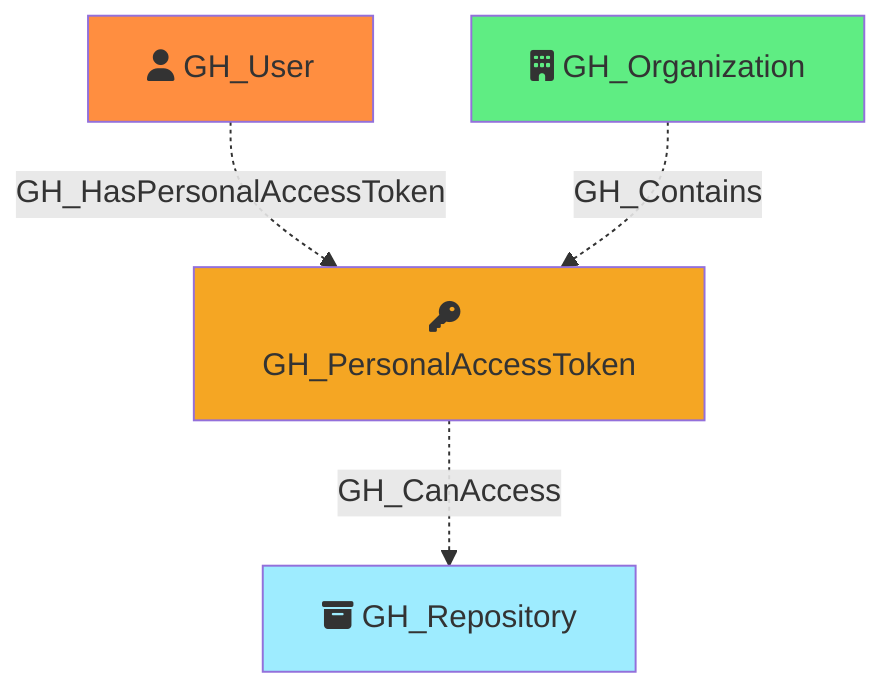

#  GH_PersonalAccessToken

Represents a fine-grained personal access token that has been granted access to organization resources. PATs are linked to their owning user, the organization, and the repositories they can access. The permissions granted to the token are captured as a JSON string in the properties.

Created by: `Git-HoundPersonalAccessToken`

## Properties

| Property Name        | Data Type | Description                                                                                           |
| -------------------- | --------- | ----------------------------------------------------------------------------------------------------- |
| objectid             | string    | Deterministic Base64-encoded identifier, used as the unique graph identifier.                         |
| id                   | string    | The deterministic identifier (same as objectid).                                                      |
| name                 | string    | The user-assigned display name of the token.                                                          |
| environment_name     | string    | The name of the environment (GitHub organization) where the token has access.                         |
| environment_id       | string    | The node_id of the environment (GitHub organization).                                                 |
| owner_login          | string    | The login handle of the user who owns the token.                                                      |
| owner_id             | integer   | The numeric GitHub ID of the token owner.                                                             |
| owner_node_id        | string    | The GraphQL node ID of the token owner.                                                               |
| token_id             | integer   | Unique identifier of the user's token, found in audit logs and organization settings.                 |
| token_name           | string    | The user-assigned display name of the token.                                                          |
| token_expired        | boolean   | Whether the token has expired.                                                                        |
| token_expires_at     | string    | ISO 8601 timestamp of when the token expires.                                                         |
| token_last_used_at   | string    | ISO 8601 timestamp of when the token was last used.                                                   |
| repository_selection | string    | Whether the token has access to `all`, `subset`, or `none` of the organization's repositories.        |
| access_granted_at    | string    | ISO 8601 timestamp of when access was granted to the organization.                                    |
| permissions          | string    | JSON string of the permissions granted to the token (e.g., `{"organization":{},"repository":{}}`).    |

## Edges

### Outbound Edges

| Edge Kind     | Target Node    | Traversable | Description                                              |
| ------------- | -------------- | ----------- | -------------------------------------------------------- |
| GH_CanAccess  | GH_Repository  | No          | Token can access this repository.                        |

### Inbound Edges

| Edge Kind                  | Source Node      | Traversable | Description                                              |
| -------------------------- | ---------------- | ----------- | -------------------------------------------------------- |
| GH_HasPersonalAccessToken  | GH_User          | No          | User owns this personal access token.                    |
| GH_Contains                | GH_Organization  | No          | Organization contains this personal access token.        |

## Diagram

