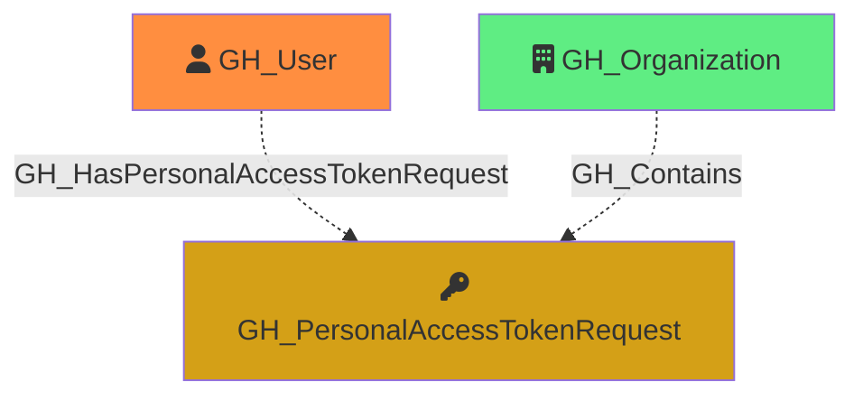

#  GH_PersonalAccessTokenRequest

Represents a pending request from an organization member to access organization resources with a fine-grained personal access token. PAT requests are linked to their owning user and the organization. The requested permissions are captured as a JSON string in the properties.

Created by: `Git-HoundPersonalAccessTokenRequest`

## Properties

| Property Name        | Data Type | Description                                                                                           |
| -------------------- | --------- | ----------------------------------------------------------------------------------------------------- |
| objectid             | string    | Deterministic Base64-encoded identifier, used as the unique graph identifier.                         |
| id                   | string    | The deterministic identifier (same as objectid).                                                      |
| name                 | string    | The user-assigned display name of the token.                                                          |
| environment_name     | string    | The name of the environment (GitHub organization) where access is being requested.                    |
| environment_id       | string    | The node_id of the environment (GitHub organization).                                                 |
| owner_login          | string    | The login handle of the user who submitted the request.                                               |
| owner_id             | integer   | The numeric GitHub ID of the requester.                                                               |
| owner_node_id        | string    | The GraphQL node ID of the requester.                                                                 |
| token_id             | integer   | Unique identifier of the user's token, found in audit logs.                                           |
| token_name           | string    | The user-assigned display name of the token.                                                          |
| token_expired        | boolean   | Whether the token has expired.                                                                        |
| token_expires_at     | string    | ISO 8601 timestamp of when the token expires.                                                         |
| token_last_used_at   | string    | ISO 8601 timestamp of when the token was last used.                                                   |
| repository_selection | string    | Whether the request targets `all`, `subset`, or `none` of the organization's repositories.            |
| reason               | string    | The rationale provided by the requester for the access request.                                       |
| created_at           | string    | ISO 8601 timestamp of when the request was submitted.                                                 |
| permissions          | string    | JSON string of the permissions being requested (e.g., `{"organization":{},"repository":{}}`).         |

## Edges

### Outbound Edges

None

### Inbound Edges

| Edge Kind                         | Source Node      | Traversable | Description                                              |
| --------------------------------- | ---------------- | ----------- | -------------------------------------------------------- |
| GH_HasPersonalAccessTokenRequest  | GH_User          | No          | User submitted this personal access token request.       |
| GH_Contains                       | GH_Organization  | No          | Organization contains this personal access token request.|

## Diagram

