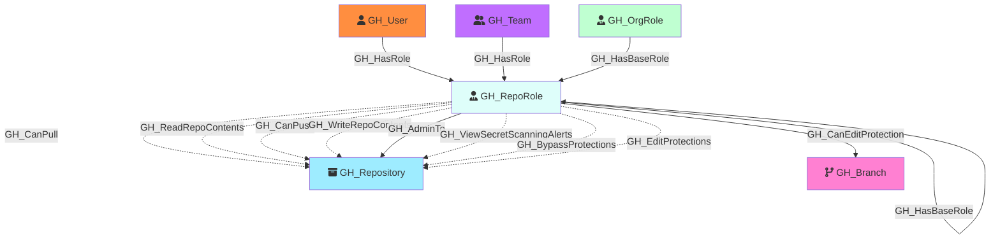

#  GH_RepoRole

Represents a repository-level permission role. Each repository has five default roles (Read, Write, Admin, Triage, Maintain) plus any custom repository roles defined at the organization level. Repo roles define what actions a user or team can perform on a specific repository. Default roles form an inheritance hierarchy (Triage → Read, Maintain → Write, Admin includes all), and custom roles inherit from one of the base roles.

Created by: `Git-HoundRepository`

## Properties

| Property Name     | Data Type | Description                                                                                      |
| ----------------- | --------- | ------------------------------------------------------------------------------------------------ |
| objectid          | string    | A deterministic ID derived from the repo node_id and role name.                                  |
| name              | string    | The fully qualified role name (e.g., `repoName\read`).                                           |
| id                | string    | Same as objectid.                                                                                |
| short_name        | string    | The short role name (e.g., `read`, `write`, `admin`, `triage`, `maintain`, or custom role name). |
| type              | string    | `default` for built-in roles or `custom` for custom repository roles.                            |
| environment_name  | string    | The name of the environment (GitHub organization).                                               |
| environment_id    | string    | The node_id of the environment (GitHub organization).                                            |

## Edges

### Outbound Edges

| Edge Kind                       | Target Node  | Traversable | Description                                                             |
| ------------------------------- | ------------ | ----------- | ----------------------------------------------------------------------- |
| GH_CanEditProtection             | GH_Branch     | Yes         | Role can modify or remove the protection rules governing this branch (computed). |
| GH_ReadRepoContents              | GH_Repository | No          | Read role can read repository contents.                                 |
| GH_WriteRepoContents             | GH_Repository | No          | Write/Admin role can push to the repository.                            |
| GHWriteRepoPullRequests         | GH_Repository | No          | Write/Admin role can create and merge pull requests.                    |
| GH_AdminTo                       | GH_Repository | No          | Admin role has full administrative access.                              |
| GHManageWebhooks                | GH_Repository | No          | Admin role can manage webhooks.                                         |
| GHManageDeployKeys              | GH_Repository | No          | Admin role can manage deploy keys.                                      |
| GHPushProtectedBranch           | GH_Repository | No          | Admin/Maintain role can push to protected branches.                     |
| GHDeleteAlertsCodeScanning      | GH_Repository | No          | Admin role can delete code scanning alerts.                             |
| GH_ViewSecretScanningAlerts      | GH_Repository | No          | Admin role can view secret scanning alerts.                             |
| GHRunOrgMigration               | GH_Repository | No          | Admin role can run organization migrations.                             |
| GHBypassBranchProtection        | GH_Repository | No          | Admin role can bypass branch protection rules.                          |
| GHManageSecurityProducts        | GH_Repository | No          | Admin role can manage security products.                                |
| GHManageRepoSecurityProducts    | GH_Repository | No          | Admin role can manage repo security products.                           |
| GHEditRepoProtections           | GH_Repository | No          | Admin role can edit branch protection rules.                            |
| GHJumpMergeQueue                | GH_Repository | No          | Admin role can jump the merge queue.                                    |
| GHCreateSoloMergeQueueEntry     | GH_Repository | No          | Admin role can create solo merge queue entries.                         |
| GHEditRepoCustomPropertiesValue | GH_Repository | No          | Admin role can edit custom property values.                             |
| GH_HasBaseRole                   | GH_RepoRole   | Yes         | Role inherits from a base role (e.g., Triage → Read, Maintain → Write). |

### Inbound Edges

| Edge Kind     | Source Node | Traversable | Description                                                                       |
| ------------- | ----------- | ----------- | --------------------------------------------------------------------------------- |
| GH_HasRole     | GH_User      | Yes         | A user is directly assigned to this repository role.                              |
| GH_HasRole     | GH_Team      | Yes         | A team is assigned to this repository role.                                       |
| GH_HasBaseRole | GH_OrgRole   | Yes         | An org-level `all_repo_*` role inherits to this repo role.                        |
| GH_HasBaseRole | GH_RepoRole  | Yes         | A higher-level repo role inherits from this role (e.g., custom role → base role). |

## Diagram

