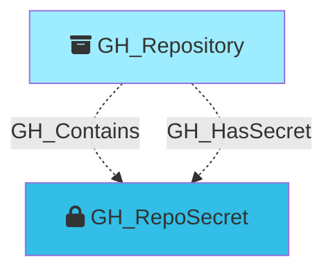

#  GH_RepoSecret

Represents a repository-level GitHub Actions secret. These are secrets defined directly on a specific repository and are only accessible to workflows running in that repository.

Created by: `Git-HoundSecret`

## Properties

| Property Name     | Data Type | Description                                                            |
| ----------------- | --------- | ---------------------------------------------------------------------- |
| objectid          | string    | A deterministic ID in the format `GHSecret_{repoNodeId}_{secretName}`. |
| id                | string    | Same as objectid.                                                      |
| name              | string    | The name of the secret.                                                |
| environment_name  | string    | The name of the environment (GitHub organization).                     |
| environment_id    | string    | The node_id of the environment (GitHub organization).                                |
| repository_name   | string    | The name of the containing repository.                                 |
| repository_id     | string    | The node_id of the containing repository.                              |
| created_at        | datetime  | When the secret was created.                                           |
| updated_at        | datetime  | When the secret was last updated.                                      |
| visibility        | string    | The secret's visibility scope.                                         |

## Edges

### Outbound Edges

None

### Inbound Edges

| Edge Kind   | Source Node  | Traversable | Description                      |
| ----------- | ------------ | ----------- | -------------------------------- |
| GH_Contains  | GH_Repository | No          | Repository contains this secret. |
| GH_HasSecret | GH_Repository | No          | Repository has this secret.      |

## Diagram

