#  GH_Repository

Represents a GitHub repository within the organization. Repository nodes capture metadata about the repo including visibility, Actions enablement status, and security configuration. Repository role nodes (GH_RepoRole) are created alongside each repository to represent the permission levels available.

Created by: `Git-HoundRepository`

## Properties

| Property Name               | Data Type | Description                                                                  |
| --------------------------- | --------- | ---------------------------------------------------------------------------- |
| objectid                    | string    | The GitHub `node_id` of the repository, used as the unique graph identifier. |
| id                          | integer   | The numeric GitHub ID of the repository.                                     |
| node_id                     | string    | The GitHub GraphQL node ID. Redundant with objectid.                         |
| name                        | string    | The repository name.                                                         |
| full_name                   | string    | The fully qualified name (e.g., `org/repo`).                                 |
| environment_name            | string    | The name of the environment (GitHub organization).                           |
| environment_id              | string    | The node_id of the environment (GitHub organization).                        |
| owner_id                    | integer   | The numeric ID of the repository owner.                                      |
| owner_node_id               | string    | The node_id of the repository owner.                                         |
| owner_name                  | string    | The login of the repository owner.                                           |
| private                     | boolean   | Whether the repository is private.                                           |
| visibility                  | string    | The visibility level: `public`, `private`, or `internal`.                    |
| html_url                    | string    | URL to the repository on GitHub.                                             |
| description                 | string    | The repository description.                                                  |
| created_at                  | datetime  | When the repository was created.                                             |
| updated_at                  | datetime  | When the repository was last updated.                                        |
| pushed_at                   | datetime  | When the repository last had a push.                                         |
| archived                    | boolean   | Whether the repository is archived.                                          |
| disabled                    | boolean   | Whether the repository is disabled.                                          |
| open_issues_count           | integer   | Number of open issues.                                                       |
| allow_forking               | boolean   | Whether forking is allowed.                                                  |
| web_commit_signoff_required | boolean   | Whether web-based commits require sign-off.                                  |
| forks                       | integer   | Number of forks.                                                             |
| open_issues                 | integer   | Number of open issues (includes pull requests).                              |
| watchers                    | integer   | Number of watchers.                                                          |
| default_branch              | string    | The name of the default branch (e.g., `main`).                               |
| actions_enabled             | boolean   | Whether GitHub Actions is enabled for this repository.                       |
| secret_scanning             | string    | Status of secret scanning (e.g., `enabled`, `disabled`).                     |

## Edges

### Outbound Edges

| Edge Kind                | Target Node                   | Traversable | Description                                                               |
| ------------------------ | ----------------------------- | ----------- | ------------------------------------------------------------------------- |
| GH_HasBranch              | GH_Branch                      | Yes         | Repository has a branch.                                                  |
| GH_HasWorkflow            | GH_Workflow                    | No          | Repository has a workflow.                                                |
| GH_HasEnvironment         | GH_Environment                 | Yes         | Repository has a deployment environment (when no custom branch policies). |
| GH_HasSecret              | GH_OrgSecret                   | Yes         | Repository has access to an organization-level secret. Traversable because write access to the repo enables secret access via workflow creation. |
| GH_HasSecret              | GH_RepoSecret                  | Yes         | Repository has a repository-level secret. Traversable because write access to the repo enables secret access via workflow creation. |
| GH_Contains               | GH_RepoSecret                  | No          | Repository contains a repository-level secret.                            |
| GH_HasSecretScanningAlert | GH_SecretScanningAlert         | No          | Repository has a secret scanning alert.                                   |
| CanAssumeIdentity        | AZFederatedIdentityCredential | Yes         | Repository can assume an Azure federated identity via OIDC (subject: *).  |

### Inbound Edges

| Edge Kind             | Source Node      | Traversable | Description                                                                                         |
| --------------------- | ---------------- | ----------- | --------------------------------------------------------------------------------------------------- |
| GH_Owns               | GH_Organization  | Yes         | Organization owns this repository.                                                                  |
| GH_WriteRepoContents  | GH_RepoRole      | No          | Repo role can write repository contents. Non-traversable because write access alone is necessary but not sufficient for push access — branch protection rules may block it. |
| GH_AdminTo            | GH_RepoRole      | Yes         | Repo role has admin access. Traversable because admin confers full control of the repository.        |
| GH_CanCreateBranch    | GH_RepoRole         | Yes       | Repo role can create new branches (computed from permissions + branch protection rules).              |
| GH_CanCreateBranch    | GH_User or GH_Team  | Yes       | User or team can create new branches via per-rule allowance (computed — delta only).                 |
| GH_CanWriteBranch     | GH_RepoRole         | Yes       | Repo role can push to ALL branches in this repo (computed from permissions + branch protection rules). |
| GH_CanWriteBranch     | GH_User or GH_Team  | Yes       | User or team can push to ALL branches via per-rule allowance (computed — delta only).                |

## Diagram

```mermaid
flowchart TD
    GH_Repository[fa:fa-box-archive GH_Repository]
    GH_Organization[fa:fa-building GH_Organization]
    GH_Branch[fa:fa-code-branch GH_Branch]
    GH_Workflow[fa:fa-cogs GH_Workflow]
    GH_Environment[fa:fa-leaf GH_Environment]
    GH_OrgSecret[fa:fa-lock GH_OrgSecret]
    GH_RepoSecret[fa:fa-lock GH_RepoSecret]
    GH_SecretScanningAlert[fa:fa-key GH_SecretScanningAlert]
    GH_RepoRole[fa:fa-user-tie GH_RepoRole]
    AWSRole[fa:fa-user-tag AWSRole]
    AZFederatedIdentityCredential[fa:fa-id-card AZFederatedIdentityCredential]

    style GH_Repository fill:#9EECFF
    style GH_Organization fill:#5FED83
    style GH_User fill:#FF8E40
    style GH_Team fill:#C06EFF
    style GH_Branch fill:#FF80D2
    style GH_Workflow fill:#FFE4A1
    style GH_Environment fill:#D5F2C2
    style GH_OrgSecret fill:#1FB65A
    style GH_RepoSecret fill:#32BEE6
    style GH_SecretScanningAlert fill:#3C7A6E
    style GH_RepoRole fill:#DEFEFA
    style AZFederatedIdentityCredential fill:#FF80D2

    GH_PersonalAccessToken[fa:fa-key GH_PersonalAccessToken]

    style GH_PersonalAccessToken fill:#F5A623

    GH_Organization -.->|GH_Owns| GH_Repository
    GH_Repository -.->|GH_HasBranch| GH_Branch
    GH_Repository -.->|GH_HasWorkflow| GH_Workflow
    GH_Repository -.->|GH_HasEnvironment| GH_Environment
    GH_Repository -.->|GH_HasSecret| GH_OrgSecret
    GH_Repository -.->|GH_Contains| GH_RepoSecret
    GH_Repository -->|GH_HasSecret| GH_RepoSecret
    GH_Repository -.->|GH_HasSecretScanningAlert| GH_SecretScanningAlert
    GH_RepoRole -.->|GH_ReadRepoContents| GH_Repository
    GH_RepoRole -.->|GH_WriteRepoContents| GH_Repository
    GH_RepoRole -.->|GH_AdminTo| GH_Repository
    GH_RepoRole -.->|GH_BypassBranchProtection| GH_Repository
    GH_RepoRole -.->|GH_EditRepoProtections| GH_Repository
    GH_RepoRole -.->|GH_ViewSecretScanningAlerts| GH_Repository
    GH_RepoRole -.->|GH_BypassProtections| GH_Repository
    GH_RepoRole -.->|GH_EditProtections| GH_Repository
    GH_Repository -.->|GH_CanAssumeAWSRole| AWSRole
    GH_Repository -->|CanAssumeIdentity| AZFederatedIdentityCredential
```

