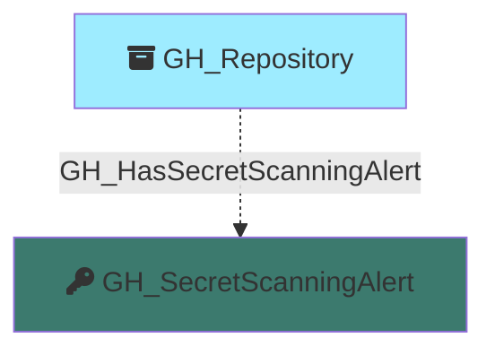

#  GH_SecretScanningAlert

Represents a GitHub secret scanning alert detected in a repository. Secret scanning alerts are raised when GitHub detects a known secret pattern (such as an API key, token, or credential) committed to a repository. The alert captures the secret type, validity status, and current resolution state.

Created by: `Git-HoundSecretScanningAlert`

## Properties

| Property Name            | Data Type | Description                                                                                    |
| ------------------------ | --------- | ---------------------------------------------------------------------------------------------- |
| objectid                 | string    | A deterministic Base64-encoded ID derived from the organization, repository, and alert number. |
| id                       | string    | Same as objectid.                                                                              |
| name                     | string    | The alert number.                                                                              |
| repository_name          | string    | The name of the repository where the secret was detected.                                      |
| repository_id            | string    | The node_id of the repository.                                                                 |
| repository_url           | string    | The HTML URL of the repository.                                                                |
| secret_type              | string    | The type of secret detected (e.g., `github_personal_access_token`, `aws_access_key_id`).       |
| secret_type_display_name | string    | A human-readable name for the secret type.                                                     |
| validity                 | string    | The validity status of the detected secret (e.g., `active`, `inactive`, `unknown`).            |
| state                    | string    | The alert state (e.g., `open`, `resolved`).                                                    |
| created_at               | datetime  | When the alert was created.                                                                    |
| updated_at               | datetime  | When the alert was last updated.                                                               |
| url                      | string    | The HTML URL to view the alert on GitHub.                                                      |

## Edges

### Outbound Edges

None

### Inbound Edges

| Edge Kind                | Source Node  | Traversable | Description                                |
| ------------------------ | ------------ | ----------- | ------------------------------------------ |
| GH_HasSecretScanningAlert | GH_Repository | No          | Repository has this secret scanning alert. |

## Diagram

