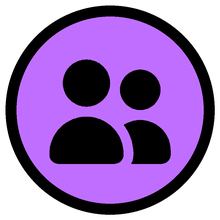
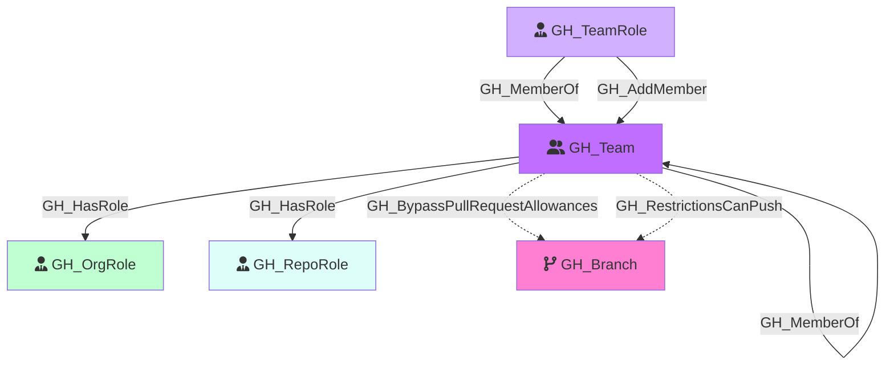

#  GH_Team

Represents a GitHub team within the organization. Teams can have parent-child relationships, contain members with different roles (Member, Maintainer), and be assigned to repository roles.

Created by: `Git-HoundTeam`

## Properties

| Property Name     | Data Type | Description                                                               |
| ----------------- | --------- | ------------------------------------------------------------------------- |
| objectid          | string    | The GitHub GraphQL `id` of the team, used as the unique graph identifier. |
| name              | string    | The team's display name, derived from the slug property.                  |
| id                | string    | The GraphQL ID of the team.                                               |
| node_id           | string    | The GitHub node ID. Redundant with objectid.                              |
| slug              | string    | The team's URL-safe slug identifier.                                      |
| description       | string    | The team's description.                                                   |
| privacy           | string    | The team's privacy level (e.g., `visible`, `secret`).                     |
| permission        | string    | The team's default permission on repositories.                            |
| environment_name  | string    | The name of the environment (GitHub organization).                        |
| environment_id    | string    | The node_id of the environment (GitHub organization).                     |

## Edges

### Outbound Edges

| Edge Kind                      | Target Node             | Traversable | Description                                                           |
| ------------------------------ | ----------------------- | ----------- | --------------------------------------------------------------------- |
| GH_MemberOf                     | GH_Team                  | Yes         | Team is a child of a parent team.                                     |
| GH_HasRole                      | GH_OrgRole               | Yes         | Team is assigned to a custom organization role.                       |
| GH_HasRole                      | GH_RepoRole              | Yes         | Team is assigned to a repository role (from Git-HoundRepositoryRole). |
| GH_BypassPullRequestAllowances | GH_BranchProtectionRule | No          | Team can bypass PR requirements on this protection rule.              |
| GH_RestrictionsCanPush          | GH_BranchProtectionRule | No          | Team is allowed to push to branches protected by this rule.           |

### Inbound Edges

| Edge Kind  | Source Node | Traversable | Description                                           |
| ---------- | ----------- | ----------- | ----------------------------------------------------- |
| GH_MemberOf | GH_TeamRole  | Yes         | A team role (Member/Maintainer) belongs to this team. |
| GH_MemberOf | GH_Team      | Yes         | A child team is a member of this team.                |

## Diagram

