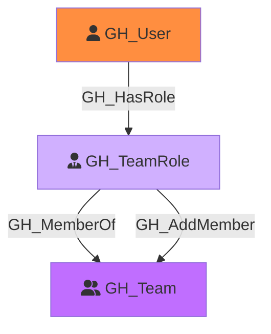

#  GH_TeamRole

Represents a role within a GitHub team. Each team has two built-in roles: Member and Maintainer. Maintainers can add and remove team members. Team roles connect users to teams and transitively to any repository roles assigned to the team.

Created by: `Git-HoundTeam`

## Properties

| Property Name     | Data Type | Description                                                                          |
| ----------------- | --------- | ------------------------------------------------------------------------------------ |
| objectid          | string    | A deterministic ID derived from the team ID and role name (e.g., `{teamId}_member`). |
| name              | string    | The fully qualified role name (e.g., `TeamSlug\member`).                             |
| id                | string    | Same as objectid.                                                                    |
| short_name        | string    | The short role name: `member` or `maintainer`.                                       |
| type              | string    | Always `default` for team roles.                                                     |
| environment_name  | string    | The name of the environment (GitHub organization).                                   |
| environment_id    | string    | The node_id of the environment (GitHub organization).                                |

## Edges

### Outbound Edges

| Edge Kind   | Target Node | Traversable | Description                                                    |
| ----------- | ----------- | ----------- | -------------------------------------------------------------- |
| GH_MemberOf  | GH_Team      | Yes         | This role belongs to a team.                                   |
| GH_AddMember | GH_Team      | Yes         | Maintainer role can add members to the team (Maintainer only). |

### Inbound Edges

| Edge Kind | Source Node | Traversable | Description                           |
| --------- | ----------- | ----------- | ------------------------------------- |
| GH_HasRole | GH_User      | Yes         | A user is assigned to this team role. |

## Diagram

