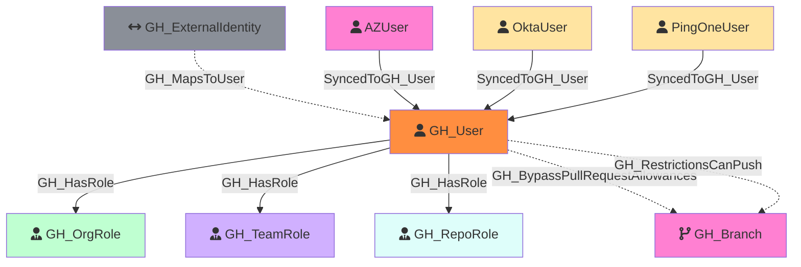

#  GH_User

Represents a GitHub user who is a member of the organization. Users are associated with organization roles (Owner or Member) and can be assigned to repository roles and team roles.

Created by: `Git-HoundUser`

## Properties

| Property Name     | Data Type | Description                                                            |
| ----------------- | --------- | ---------------------------------------------------------------------- |
| objectid          | string    | The GitHub `node_id` of the user, used as the unique graph identifier. |
| name              | string    | The user's display name, derived from the login property.              |
| login             | string    | The user's GitHub login handle.                                        |
| company           | string    | The company listed on the user's profile.                              |
| email             | string    | The user's public email address.                                       |
| full_name         | string    | The user's full name from their profile.                               |
| type              | string    | The account type (e.g., `User`).                                       |
| twitter_username  | string    | The user's Twitter username.                                           |
| site_admin        | boolean   | Whether the user is a GitHub site administrator.                       |
| id                | integer   | The numeric GitHub ID of the user.                                     |
| node_id           | string    | The GitHub GraphQL node ID. Redundant with objectid.                   |
| environment_name  | string    | The name of the environment (GitHub organization) the user belongs to. |
| environment_id    | string    | The node_id of the environment (GitHub organization).                  |

## Edges

### Outbound Edges

| Edge Kind | Target Node | Traversable | Description                                                                    |
| --------- | ----------- | ----------- | ------------------------------------------------------------------------------ |
| GH_HasRole | GH_OrgRole   | Yes         | User is assigned to an organization role (Owner or Member).                    |
| GH_HasRole | GH_RepoRole  | Yes         | User is directly assigned to a repository role (from Git-HoundRepositoryRole). |
| GH_HasRole | GH_TeamRole  | Yes         | User has a team role (Member or Maintainer).                                   |

### Inbound Edges

| Edge Kind    | Source Node        | Traversable | Description                                              |
| ------------ | ------------------ | ----------- | -------------------------------------------------------- |
| GH_MapsToUser | GH_ExternalIdentity | No          | An external SAML/SCIM identity maps to this GitHub user. |

## Diagram

