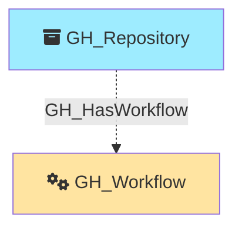

#  GH_Workflow

Represents a GitHub Actions workflow defined in a repository. Workflow nodes capture the workflow definition metadata including its file path, state, and containing repository. Only repositories with GitHub Actions enabled are queried for workflows.

Created by: `Git-HoundWorkflow`

## Properties

| Property Name     | Data Type | Description                                                                  |
| ----------------- | --------- | ---------------------------------------------------------------------------- |
| objectid          | string    | The GitHub `node_id` of the workflow, used as the unique graph identifier.   |
| name              | string    | The fully qualified workflow name (e.g., `repoName\CI Build`).               |
| short_name        | string    | The workflow's display name.                                                 |
| id                | integer   | The numeric GitHub ID of the workflow.                                       |
| node_id           | string    | The GitHub GraphQL node ID. Redundant with objectid.                         |
| environment_name  | string    | The name of the environment (GitHub organization).                           |
| environment_id    | string    | The node_id of the environment (GitHub organization).                        |
| repository_name   | string    | The full name of the containing repository.                                  |
| repository_id     | string    | The node_id of the containing repository.                                    |
| path              | string    | The file path of the workflow definition (e.g., `.github/workflows/ci.yml`). |
| state             | string    | The workflow state (e.g., `active`, `disabled_manually`).                    |
| url               | string    | The API URL for the workflow.                                                |

## Edges

### Outbound Edges

None

### Inbound Edges

| Edge Kind     | Source Node  | Traversable | Description                   |
| ------------- | ------------ | ----------- | ----------------------------- |
| GH_HasWorkflow | GH_Repository | No          | Repository has this workflow. |

## Diagram

