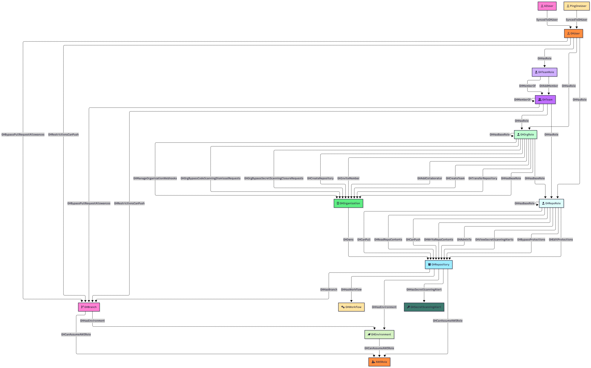

# GitHound


## Overview

**GitHound** is a BloodHound OpenGraph collector for GitHub, designed to map your organization’s structure and permissions into a navigable attack‑path graph. It:

- **Models Key GitHub Entities**  
  - **GH_Organization**: Your GitHub org metadata  
  - **GH_User**: Individual user accounts in the org  
  - **GH_Team**: Teams that group users for shared access  
  - **GH_Repository**: Repositories within the org  
  - **GH_Branch**: Named branches in each repo  
  - **GH_OrgRole**, **GH_TeamRole**, **GH_RepoRole**: Org‑, team‑, and repo‑level roles/permissions  

- **Visualize & Analyze in BloodHound**  
  - **Access Audits**: See at a glance who has admin/write/read on repos and branches  
  - **Compliance Checks**: Validate least‑privilege across teams and repos  
  - **Incident Response**: Trace privilege escalations and group memberships  

With GitHound, you get a clear, interactive graph of your GitHub permissions landscape—perfect for security reviews, compliance audits, and rapid incident investigations.

## Quick Start

```powershell
# 1. Load the collector
. ./githound.ps1

# 2. Create a session with your Personal Access Token
$session = New-GitHubSession -OrganizationName "YourOrgName" -Token (Get-Clipboard)

# 3. Run the collection
Invoke-GitHound -Session $session

# 4. Upload the resulting githound_*.json file to BloodHound
```

For detailed setup instructions, see:
- [Personal Access Token Collection](./Documentation/COLLECTION.md) — Standard collection using PATs
- [App Installation Collection](./Documentation/APP-COLLECTION.md) — Higher rate limits via GitHub App
- [Troubleshooting](./Documentation/TROUBLESHOOTING.md) — Common issues and solutions

## Schema



### Nodes

Nodes correspond to each object type. For detailed property information and edge relationships, see the individual node documentation in [Documentation/Nodes](./Documentation/Nodes/).

| Node                                                                                      | Icon              | Color   | Description                                                                                                                |
|-------------------------------------------------------------------------------------------|-------------------|---------|----------------------------------------------------------------------------------------------------------------------------|
|  GH_AppInstallation            | plug              | #A8D8EA | A GitHub App installed on the organization with specific permissions and repository access scope.                          |
|  GH_Branch                              | code-branch       | #FF80D2 | A named reference in a repository (e.g. `main`, `develop`) representing a line of development.                             |
|  GH_Environment                    | leaf              | #D5F2C2 | A GitHub Actions deployment environment with protection rules, required reviewers, and deployment branch policies.         |
|  GH_EnvironmentSecret        | lock              | #6FB94A | An environment-level GitHub Actions secret scoped to a specific deployment environment.                                    |
|  GH_ExternalIdentity          | arrows-left-right | #8A8F98 | An external identity from a SAML/SCIM provider (Okta, Azure AD, etc.) linked to a GitHub user for SSO authentication.      |
|  GH_Organization                  | building          | #5FED83 | A GitHub Organization—top‑level container for repositories, teams, & settings.                                             |
|  GH_OrgRole                            | user-tie          | #BFFFD1 | The role a user has at the organization level (e.g. `admin`, `member`).                                                    |
|  GH_OrgSecret                        | lock              | #1FB65A | An organization-level GitHub Actions secret that can be scoped to all, private, or selected repositories.                  |
|  GH_Repository                      | box-archive       | #9EECFF | A code repository in an organization (or user account), containing files, issues, etc.                                     |
|  GH_RepoRole                          | user-tie          | #DEFEFA | The permission granted to a user or team on a repository (e.g. `admin`, `write`, `read`).                                  |
|  GH_RepoSecret                      | lock              | #32BEE6 | A repository-level GitHub Actions secret accessible only to workflows in that specific repository.                         |
|  GH_SamlIdentityProvider  | id-badge          | #5A6C8F | A SAML identity provider configured for the organization, enabling SSO and linking external identities to GitHub users.    |
|  GH_SecretScanningAlert    | key               | #3C7A6E | A GitHub Advanced Security alert indicating a secret was accidentally committed to a repository.                           |
|  GH_Team                                  | user-group        | #C06EFF | A team within an organization, grouping users for shared access and collaboration.                                         |
|  GH_TeamRole                          | user-tie          | #D0B0FF | The role a user has within a team (e.g. `maintainer`, `member`).                                                           |
|  GH_User                                  | user              | #FF8E40 | An individual GitHub user account.                                                                                         |
|  GH_Workflow                          | cogs              | #FFE4A1 | A GitHub Actions workflow defined in a repository, capturing workflow metadata and state.                                  |

### Edges

GitHound models 50+ edge types representing permissions, memberships, and cross-cloud relationships. See [Documentation/SCHEMA.md](./Documentation/SCHEMA.md) for the complete edge reference.

**Key edge categories:**

| Category | Key Edges | Description |
|----------|-----------|-------------|
| **Containment** | `GH_Contains`, `GH_Owns` | Organizational hierarchy |
| **Role Assignment** | `GH_HasRole`, `GH_MemberOf`, `GH_HasBaseRole` | Who has which roles |
| **Repository Permissions** | `GH_AdminTo`, `GH_CanPush`, `GH_CanPull` | What roles can do |
| **Branch Protections** | `GH_BypassPullRequestAllowances`, `GH_RestrictionsCanPush` | Branch-level access |
| **Secrets** | `GH_HasSecret` | Secret access mapping |
| **Cross-Cloud** | `CanAssumeIdentity`, `SyncedToGHUser`, `GH_CanAssumeAWSRole` | Attack paths to Azure/AWS |

**Primary attack path pattern:**

```cypher
(:GH_User)-[:GH_HasRole|GH_MemberOf|GH_AddMember*1..]->(:GH_RepoRole)-[:GH_AdminTo|GH_CanPush]->(:GH_Repository)
```

## Usage Examples

### What Repos does a User have Write Access to?

Find the object identifier for your target user:

```cypher
MATCH (n:GH_User)
RETURN n
```

HINT: Select Table Layout

https://github.com/user-attachments/assets/1ddfd075-2a15-4aa9-bad7-74c43e6c82d6

Replace the `<object_id>` value in the subsequent query with the user's object identifier:

```cypher
MATCH p = (:GH_User {objectid:"<object_id>"})-[:GH_MemberOf|GH_AddMember|GH_HasRole|GH_HasBaseRole|GH_Owns*1..]->(:GH_RepoRole)-[:GH_WriteRepoContents]->(:GH_Repository)
RETURN p
```


### Who has Write Access to a Repo?

Obtain the object identifier for your target repository:

```cypher
MATCH (n:GH_Repository)
RETURN n
```

Take the object identifier for your target repository and replace the `<object_id>` value in the subsequent query with it:

```cypher
MATCH p = (:GH_User)-[:GH_MemberOf|GH_HasRole|GH_HasBaseRole|GH_Owns|GH_AddMember*1..]->(:GH_RepoRole)-[:GH_WriteRepoContents]->(:GH_Repository {objectid:"<object_id>"})
RETURN p
```


### Members of the Organization Admins (Domain Admin equivalent)?

```cypher
MATCH p = (:GH_User)-[:GH_HasRole|GH_HasBaseRole]->(:GH_OrgRole {short_name: "owners"})
RETURN p
```


### Users that are managed via SSO (Entra-only)

```cypher
MATCH p = (:AZUser)-[:SyncedToGHUser]->(:GH_User)
RETURN p
```


### Cross-Cloud Attack Paths: GitHub to Azure

Find GitHub entities that can assume Azure federated identities (OIDC trust relationships):

```cypher
// All GitHub → Azure OIDC attack paths
MATCH p = (:GH_Repository|GH_Branch|GH_Environment)-[:CanAssumeIdentity]->(:AZFederatedIdentityCredential)
RETURN p

// Users with paths to Azure via GitHub Actions
MATCH p = (:GH_User)-[:GH_HasRole|GH_MemberOf|GH_AddMember*1..]->(:GH_RepoRole)-[:GH_CanPush]->(:GH_Repository)-[:CanAssumeIdentity]->(:AZFederatedIdentityCredential)
RETURN p
```

### Which Repositories Have Access to Organization Secrets?

```cypher
MATCH p = (:GH_Repository)-[:GH_HasSecret]->(:GH_OrgSecret)
RETURN p
```

### Repositories with Secret Scanning Alerts

```cypher
MATCH p = (:GH_Repository)-[:GH_HasSecretScanningAlert]->(:GH_SecretScanningAlert)
RETURN p
```

## Contributing

We welcome and appreciate your contributions! To make the process smooth and efficient, please follow these steps:

1. **Discuss Your Idea**  
   - If you’ve found a bug or want to propose a new feature, please start by opening an issue in this repo. Describe the problem or enhancement clearly so we can discuss the best approach.

2. **Fork & Create a Branch**  
   - Fork this repository to your own account.  
   - Create a topic branch for your work:

     ```bash
     git checkout -b feat/my-new-feature
     ```

3. **Implement & Test**  
   - Follow the existing style and patterns in the repo.  
   - Add or update any tests/examples to cover your changes.  
   - Verify your code runs as expected:

     ```bash
     # e.g. dot-source the collector and run it, or load the model.json in BloodHound
     ```

4. **Submit a Pull Request**  
   - Push your branch to your fork:

     ```bash
     git push origin feat/my-new-feature
     ```  

   - Open a Pull Request against the `main` branch of this repository.  
   - In your PR description, please include:
     - **What** you’ve changed and **why**.  
     - **How** to reproduce/test your changes.

5. **Review & Merge**  
   - I’ll review your PR, give feedback if needed, and merge once everything checks out.  
   - For larger or more complex changes, review may take a little longer—thanks in advance for your patience!

Thank you for helping improve this extension! 🎉  

## Licensing

```text
Copyright 2025 Jared Atkinson

Licensed under the Apache License, Version 2.0
you may not use this file except in compliance with the License.
You may obtain a copy of the License at

    http://www.apache.org/licenses/LICENSE-2.0

Unless required by applicable law or agreed to in writing, software
distributed under the License is distributed on an "AS IS" BASIS,
WITHOUT WARRANTIES OR CONDITIONS OF ANY KIND, either express or implied.
See the License for the specific language governing permissions and
limitations under the License.
```

Unless otherwise annotated by a lower-level LICENSE file or license header, all files in this repository are released
under the `Apache-2.0` license. A full copy of the license may be found in the top-level [LICENSE](LICENSE) file.
